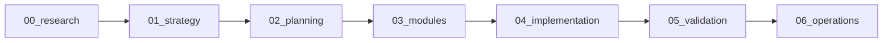

# 📚 Granger Documentation Index

> **Navigation guide for the reorganized Granger documentation following the natural development workflow**

## Documentation Workflow

Our documentation follows the natural progression of development:

---

## 📂 Directory Structure

### 00_research/ - Starting Point
Where we gather knowledge and insights:
- **transcripts/** - Video transcripts (tmux, MCP servers, etc.)
- **papers/** - Academic papers and research
- **external_docs/** - Third-party documentation

### 01_strategy/ - Architecture & Vision
Where we design and strategize:
- **ideas/** - Strategy documents (parallel testing, world models, etc.)
- **architecture/** - Core concepts, patterns, interaction levels
- **whitepaper/** - Vision documents and competitive analysis

### 02_planning/ - Task Management
Where we plan implementation:
- **active_tasks/** - Current sprint tasks (TASK_LIST_TEMPLATE_GUIDE_V2 format)
- **completed_tasks/** - Archived completed tasks
- **templates/** - Task list templates and guides

### 03_modules/ - Component Documentation
Where we document each module:
- **hub/** - granger_hub (central orchestration)
- **spokes/** - All spoke projects (sparta, marker, arangodb, etc.)
- **infrastructure/** - Supporting services (RL Commons, Test Reporter)

### 04_implementation/ - How-To Guides
Where we explain implementation:
- **integration/** - Integration patterns and MCP standards
- **tutorials/** - Step-by-step guides
- **examples/** - Code examples and scenarios

### 05_validation/ - Testing & Verification
Where we validate everything works:
- **test_plans/** - Testing strategies and plans
- **test_reports/** - Execution reports and results
- **verification/** - Critical verification and audits

### 06_operations/ - Live System Management
Where we track current state:
- **current_state/** - System status and health
- **monitoring/** - Dashboards and metrics
- **maintenance/** - Operational procedures

### 07_style_conventions/ - Development Standards 🚨
Where we define mandatory standards:
- **GRANGER_MODULE_STANDARDS.md** - Core requirements for all modules
- **GRANGER_MONOREPO_ARCHITECTURE.md** - Ecosystem architecture patterns
- **README.md** - Quick navigation to all standards

### archive/ - Historical Documents
Where we preserve history:
- **2025-01/** - January 2025 archive
- **2025-06/** - June 2025 archive
- **deprecated/** - Outdated but historically relevant

---

## 🔍 Quick Links

### 🚨 Essential Standards (MANDATORY)
- **[Module Standards](07_style_conventions/GRANGER_MODULE_STANDARDS.md)** - Required standards for ALL modules
- **[Dependency Quick Reference](../guides/DEPENDENCY_QUICK_REFERENCE.md)** - Quick fixes for dependency issues

### Essential Documents
- [GRANGER_PROJECTS.md](GRANGER_PROJECTS.md) - Complete project registry
- [Slash Commands Guide](../guides/GRANGER_SLASH_COMMANDS_GUIDE.md) - Daily verification and project management commands
- [CLAUDE.md](../CLAUDE.md) - Workspace context and standards
- [Task Template Guide](../guides/TASK_LIST_TEMPLATE_GUIDE_V2.md) - How to create task lists

### Current Focus
- [Active Tasks](02_planning/active_tasks/) - What we're working on now
- [Latest Test Reports](05_validation/test_reports/) - Recent test results
- [System Status](06_operations/current_state/) - Current system health

### Key Strategies
- [Parallel Testing Strategy](01_strategy/ideas/GRANGER_PARALLEL_TESTING_STRATEGY.md)
- [World Model Strategy](01_strategy/ideas/GRANGER_AUTONOMOUS_WORLD_MODEL_STRATEGY.md)
- [RL Integration](01_strategy/whitepaper/004_Granger_Reinforcement_Learning_Integration.md)

---

## 📋 Document Types

### By Purpose
- **Research**: Transcripts, papers → `00_research/`
- **Design**: Architecture, patterns → `01_strategy/`
- **Planning**: Task lists, sprints → `02_planning/`
- **Reference**: Module specs → `03_modules/`
- **Learning**: Tutorials, examples → `04_implementation/`
- **Quality**: Test reports → `05_validation/`
- **Operations**: Monitoring, state → `06_operations/`

### By Lifecycle
- **Active**: Currently maintained → Main directories
- **Historical**: Completed/outdated → `archive/`
- **Templates**: Reusable formats → `*/templates/`

---

## 🚀 Getting Started

### For New Contributors
1. Start with [00_research/transcripts/](00_research/transcripts/) to understand concepts
2. Read [01_strategy/whitepaper/](01_strategy/whitepaper/) for vision
3. Check [02_planning/active_tasks/](02_planning/active_tasks/) for current work
4. Use [04_implementation/tutorials/](04_implementation/tutorials/) for how-to guides

### For Developers
1. Find your module in [03_modules/](03_modules/)
2. Check integration patterns in [04_implementation/integration/](04_implementation/integration/)
3. Review test plans in [05_validation/test_plans/](05_validation/test_plans/)
4. Monitor system in [06_operations/](06_operations/)

---

## 📝 Contributing

When adding new documentation:
1. **Identify the stage**: Research? Strategy? Planning? Implementation?
2. **Place in correct directory**: Follow the numbered workflow
3. **Update indexes**: Add to relevant section indexes
4. **Cross-reference**: Link related documents
5. **Archive when complete**: Move outdated docs to archive/

---

*Last Updated: January 2025*  
*Part of the Granger Autonomous Research Ecosystem*