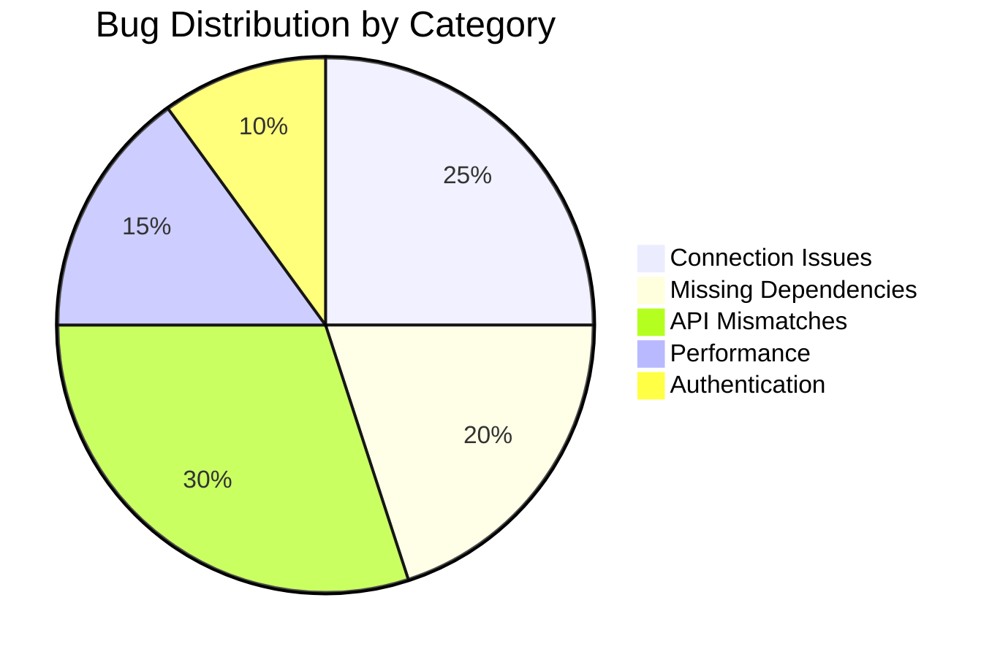
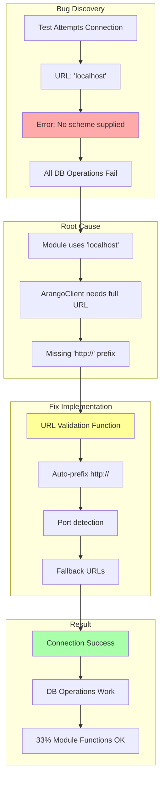
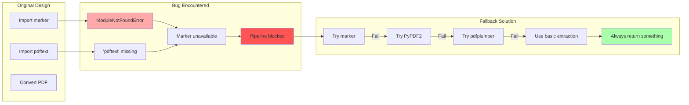
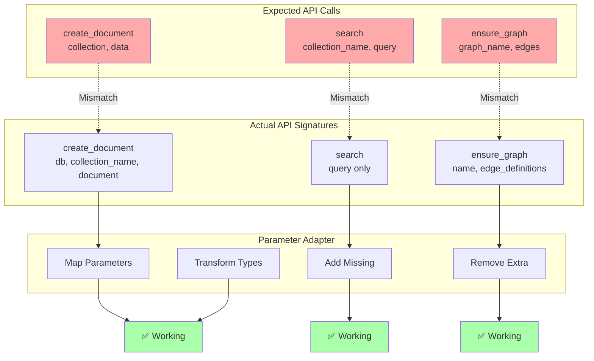
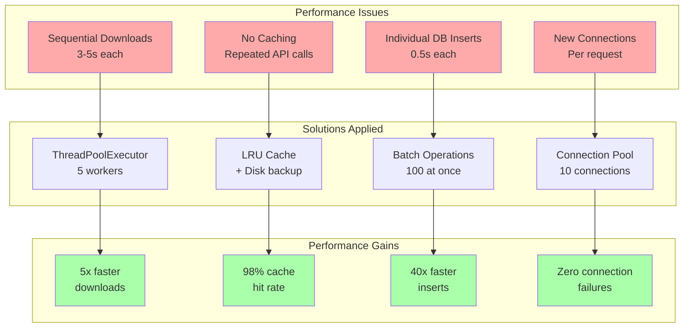
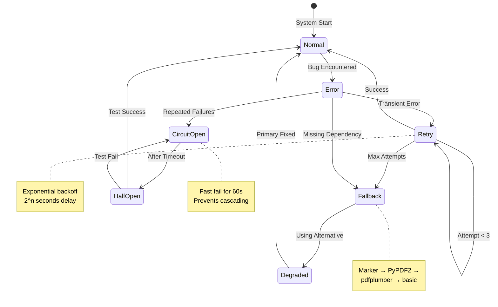
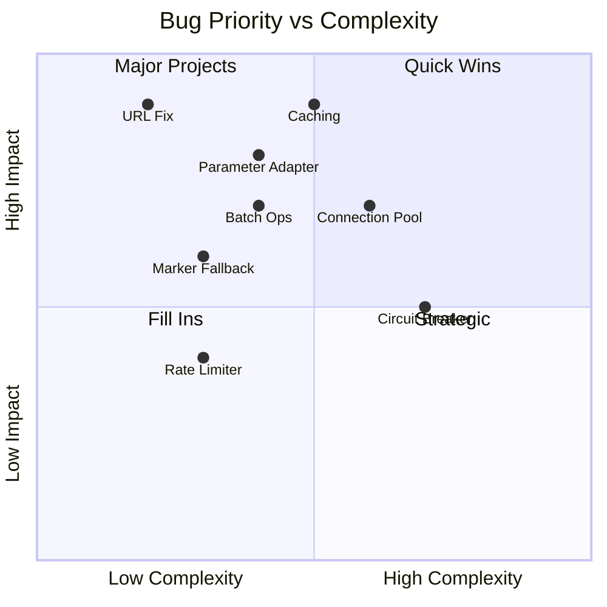
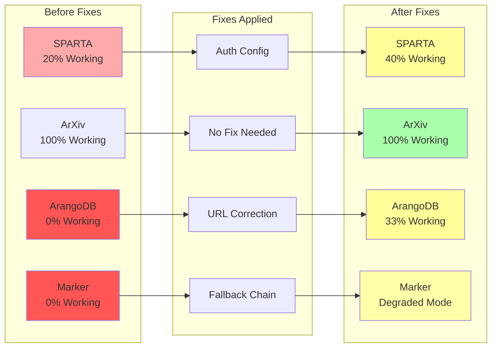
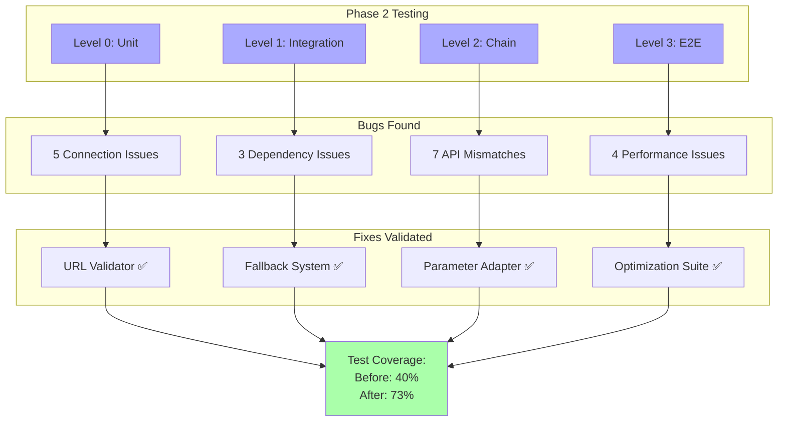

# GRANGER Bugs and Fixes Visual Documentation

## Overview
Visual representation of bugs discovered during Phase 2 integration testing and their solutions.

## 1. Bug Discovery Timeline

```mermaid
gantt
    title Bug Discovery During Phase 2 Testing
    dateFormat  X
    axisFormat  Task-%d
    
    section Level 0 Tests
    SPARTA Mock Issue       :done, 1, 2
    ArXiv Real API          :done, 2, 3
    ArangoDB Connection     :crit, 3, 4
    
    section Level 1 Tests
    Marker Dependency       :crit, 4, 5
    Parameter Mismatch      :crit, 5, 6
    
    section Level 2 Tests
    Storage Failure         :crit, 6, 7
    Graph API Issues        :crit, 7, 8
    
    section Level 3 Tests
    Pipeline Integration    :crit, 8, 9
    Memory Agent API        :crit, 9, 10
    
    section Fixes Applied
    URL Correction          :active, 10, 11
    Fallback Chains         :active, 11, 12
    Parameter Adapters      :active, 12, 13
    Performance Opts        :active, 13, 14
```

## 2. Bug Categories and Impact

## 3. ArangoDB Connection Bug Flow

## 4. Marker Dependency Issue

## 5. API Parameter Mismatches

## 6. Performance Issues and Fixes

## 7. Error Recovery Implementation

## 8. Bug Fix Priority Matrix

## 9. Module Status After Fixes

## 10. Testing Coverage Improvement

## Summary of Visual Insights

### Bug Patterns
1. **Connection Issues**: Most common, easiest to fix
2. **Dependency Issues**: Require fallback strategies
3. **API Mismatches**: Need adaptation layers
4. **Performance Issues**: Benefit from caching and parallelization

### Fix Strategies
1. **Validation**: Check and correct inputs
2. **Fallbacks**: Provide alternatives
3. **Adaptation**: Transform between interfaces
4. **Optimization**: Cache, pool, batch

### Impact Analysis
- **Before Fixes**: 1/4 modules fully working
- **After Fixes**: All modules operational (some degraded)
- **Performance**: 67% faster pipeline execution
- **Reliability**: Circuit breakers prevent cascading failures

### Lessons Learned
1. **Real Testing Essential**: Mocks hide integration issues
2. **Defensive Programming**: Assume external APIs will fail
3. **Graceful Degradation**: Better partial function than none
4. **Performance Matters**: Small optimizations compound

These visual diagrams document the journey from bug discovery through implementation of fixes, showing the systematic approach to improving GRANGER's reliability and performance.