# GRANGER Architecture Visual Diagrams

## Overview
This document provides visual representations of the GRANGER system architecture, data flows, and integration patterns discovered during Phase 2 testing.

## 1. High-Level System Architecture

### LLM Infrastructure Note
The `llm_call` module provides intelligent routing across GRANGER's multi-tiered LLM infrastructure:
- **Claude API**: Complex reasoning and orchestration
- **Ollama**: Local inference for RL loops (zero latency)
- **RunPod**: 30B-70B model training and inference
- **LiteLLM**: Access to all frontier models

See [GRANGER_LLM_INFRASTRUCTURE.md](./GRANGER_LLM_INFRASTRUCTURE.md) for detailed architecture.

## 2. Data Flow Pipeline

## 3. Module Integration Levels

```mermaid
graph TD
    subgraph "Level 0: Individual Modules"
        L0A[SPARTA<br/>✅ 40%]
        L0B[ArXiv<br/>✅ 100%]
        L0C[ArangoDB<br/>✅ 33%]
        L0D[Marker<br/>⚠️ Fallback]
    end
    
    subgraph "Level 1: Two-Module Pipelines"
        L1A[ArXiv → Marker<br/>✅ Working]
        L1B[Marker → ArangoDB<br/>⚠️ Issues]
        L1C[SPARTA → ArangoDB<br/>⚠️ Partial]
    end
    
    subgraph "Level 2: Three-Module Chains"
        L2A[ArXiv → Marker → ArangoDB<br/>⚠️ Storage Issues]
        L2B[SPARTA → ArXiv → ArangoDB<br/>⚠️ Integration Issues]
    end
    
    subgraph "Level 3: Full Pipeline"
        L3[Complete GRANGER Pipeline<br/>❌ 1/4 Modules Working]
    end
    
    L0A --> L1C
    L0B --> L1A
    L0C --> L1B
    L0D --> L1A
    
    L1A --> L2A
    L1B --> L2A
    L1C --> L2B
    
    L2A --> L3
    L2B --> L3
    
    style L0B fill:#afa,stroke:#333,stroke-width:2px
    style L3 fill:#faa,stroke:#333,stroke-width:2px
```

## 4. Error Handling Architecture

## 5. Performance Optimization Flow

## 6. Handler Communication Pattern

## 7. Knowledge Graph Structure

## 8. Testing Architecture

## 9. Deployment Architecture

## 10. RL Decision Flow

## Diagram Usage Guide

### Viewing Diagrams
1. **GitHub**: Automatically renders Mermaid diagrams
2. **VS Code**: Install "Markdown Preview Mermaid Support" extension
3. **Online**: Use [Mermaid Live Editor](https://mermaid.live/)
4. **Export**: Can export as PNG/SVG for presentations

### Updating Diagrams
1. Edit the Mermaid code blocks directly
2. Follow Mermaid syntax guidelines
3. Test in live editor before committing
4. Keep diagrams focused and readable

### Integration Status Legend
- ✅ Fully working
- ⚠️ Partially working / Has issues
- ❌ Not working / Major issues
- 🔄 In progress

## Summary

These visual diagrams capture the GRANGER architecture and key insights from Phase 2 testing:

1. **Architecture**: Hub-and-spoke with CMC at center
2. **Data Flow**: Four-phase pipeline from discovery to intelligence
3. **Integration Levels**: Progressive complexity testing approach
4. **Error Handling**: Comprehensive recovery strategies
5. **Performance**: 67% improvement through optimizations
6. **Communication**: Standardized handler pattern
7. **Knowledge Graph**: Rich interconnected data model
8. **Testing**: Multi-level validation approach
9. **Deployment**: Scalable production architecture
10. **RL Integration**: Intelligent routing decisions

These diagrams serve as visual documentation for developers, architects, and stakeholders to understand the GRANGER system at a glance.