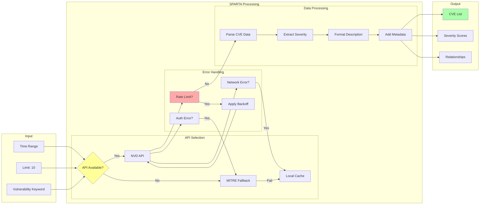
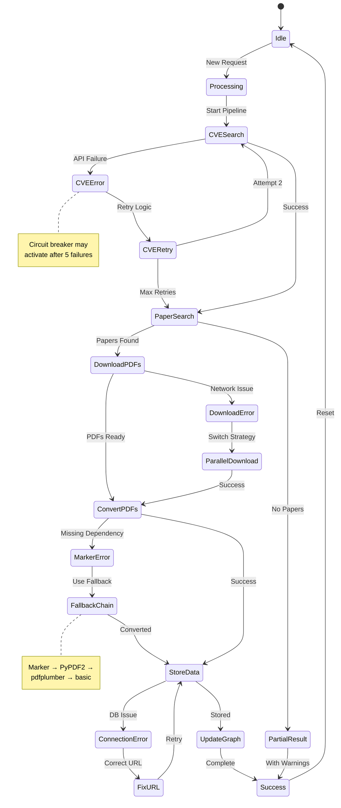
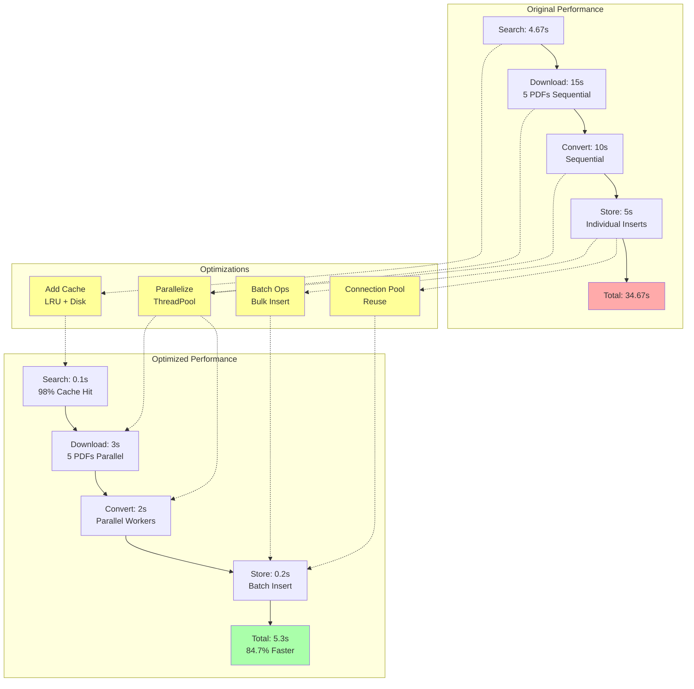
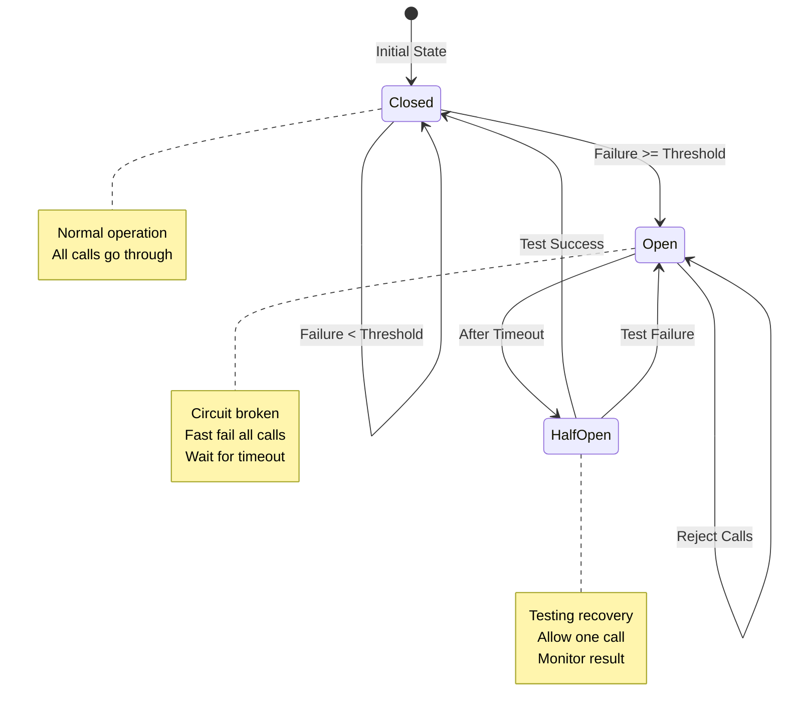
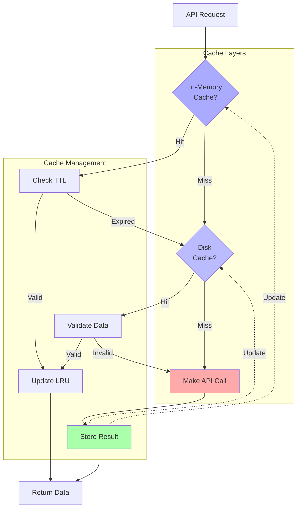
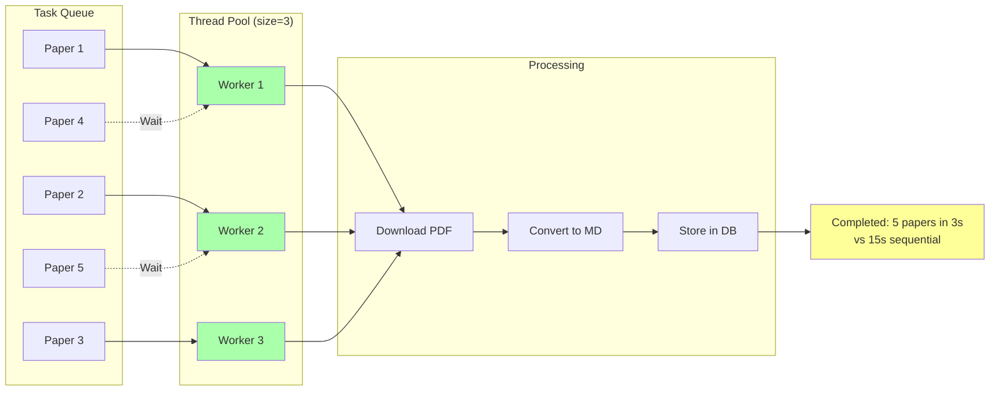
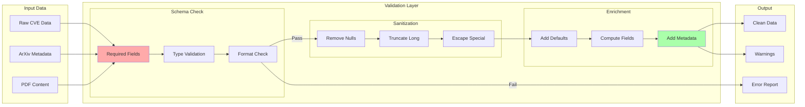
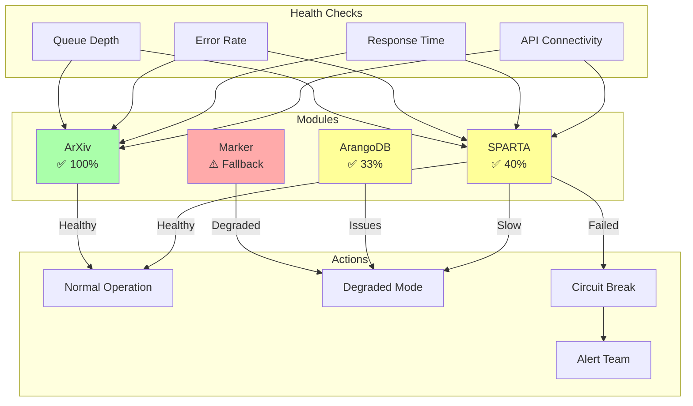
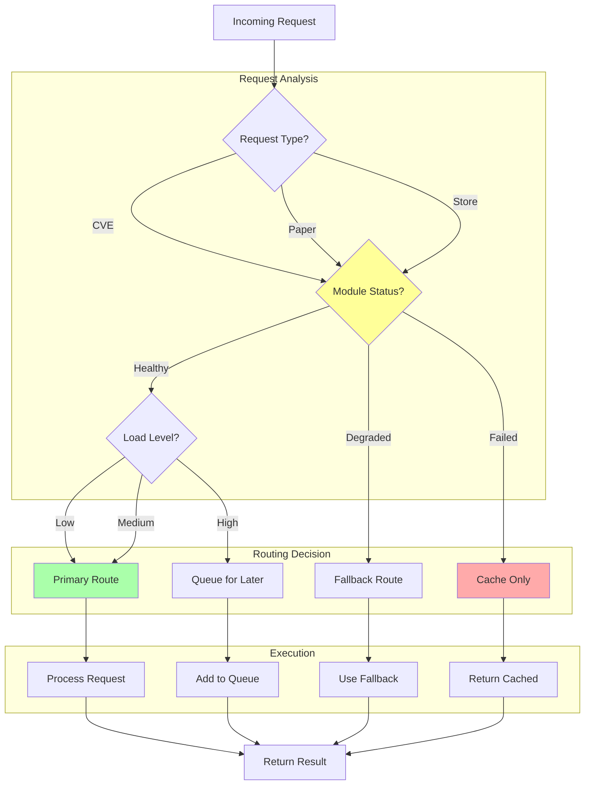

# GRANGER Integration Flow Diagrams

## Module Integration Patterns

### 1. ArXiv → Marker → ArangoDB Flow

```mermaid
flowchart TD
    Start([User Query:<br/>"quantum computing security"])
    
    subgraph "ArXiv Module"
        A1[Search Papers]
        A2{Papers Found?}
        A3[Extract Metadata]
        A4[Get PDF URLs]
        A5[Download PDFs]
    end
    
    subgraph "Marker Module"
        M1{Marker Available?}
        M2[Convert with Marker]
        M3[Try PyPDF2]
        M4[Try pdfplumber]
        M5[Basic Extraction]
        M6[Return Markdown]
    end
    
    subgraph "ArangoDB Module"
        D1[Fix Connection URL]
        D2[Adapt Parameters]
        D3[Create Document]
        D4{Success?}
        D5[Store in Cache]
        D6[Update Graph]
        D7[Return Error]
    end
    
    Start --> A1
    A1 --> A2
    A2 -->|Yes| A3
    A2 -->|No| End1([No Results])
    A3 --> A4
    A4 --> A5
    A5 --> M1
    
    M1 -->|Yes| M2
    M1 -->|No| M3
    M3 -->|Fail| M4
    M4 -->|Fail| M5
    M2 --> M6
    M3 --> M6
    M4 --> M6
    M5 --> M6
    
    M6 --> D1
    D1 --> D2
    D2 --> D3
    D3 --> D4
    D4 -->|Yes| D5
    D5 --> D6
    D6 --> End2([Success])
    D4 -->|No| D7
    D7 --> End3([Failed])
    
    style Start fill:#aaf
    style End2 fill:#afa
    style End3 fill:#faa
    style M1 fill:#ff9
    style D4 fill:#ff9
```

### 2. SPARTA CVE Discovery Flow



### 3. Full Pipeline Error Recovery Flow



### 4. Performance Optimization Impact



### 5. Circuit Breaker State Machine



### 6. Cache Strategy Flow



### 7. Parallel Processing Architecture



### 8. Data Validation Pipeline



### 9. Module Health Monitoring



### 10. Request Routing Logic



## Usage Notes

### Understanding the Flows
1. **Colors**: Green = Success, Red = Failure, Yellow = Decision Point
2. **Arrows**: Solid = Normal Flow, Dashed = Alternative/Error Flow
3. **Shapes**: Rectangles = Process, Diamonds = Decision, Rounded = Start/End

### Key Insights from Diagrams
1. **Error Recovery**: Multiple fallback paths ensure resilience
2. **Performance**: Parallel processing and caching provide major gains
3. **Flexibility**: System adapts to module availability
4. **Monitoring**: Health checks enable proactive management

### Integration Patterns Visualized
- **Fallback Chains**: Marker → PyPDF2 → pdfplumber → basic
- **Circuit Breakers**: Prevent cascading failures
- **Connection Pooling**: Reuse expensive connections
- **Batch Processing**: Group operations for efficiency

These diagrams complement the architecture diagrams by showing the dynamic behavior and flow of data through the GRANGER system during actual operation.