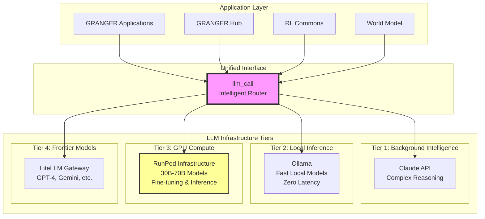

# GRANGER Multi-Tiered LLM Infrastructure

## Executive Summary

The GRANGER ecosystem implements a sophisticated multi-tiered LLM infrastructure that optimizes for performance, cost, and capability across different use cases. All tiers are unified through the `llm_call` package, providing a single interface for seamless model selection and routing.

## Architecture Overview



## Infrastructure Tiers

### Tier 1: Background Intelligence (Claude)
- **Provider**: Anthropic Claude API
- **Models**: Claude-3 Opus, Sonnet, Haiku
- **Primary Use Cases**:
  - Complex multi-step reasoning
  - Project planning and architecture
  - Code generation and analysis
  - Human interaction and explanation
  - Orchestration of other models
- **Strengths**: Superior reasoning, context handling, safety
- **Access Pattern**: `llm_call.claude(prompt, model="claude-3-opus")`

### Tier 2: Local Inference (Ollama)
- **Provider**: Local Ollama instance
- **Models**: Llama 3, Mistral, Phi, CodeLlama, etc.
- **Primary Use Cases**:
  - Reinforcement learning reward calculations
  - Fast iterative processing
  - Privacy-sensitive operations
  - Continuous learning loops
  - Development and testing
- **Strengths**: Zero latency, privacy, no API costs
- **Access Pattern**: `llm_call.local(prompt, model="llama3:8b")`

### Tier 3: GPU Compute (RunPod)
- **Provider**: RunPod GPU instances via `runpod_ops`
- **Models**: 30B-70B parameter models
- **Primary Use Cases**:
  - Model fine-tuning with Unsloth
  - High-performance batch inference
  - Serving custom fine-tuned models
  - Resource-intensive tasks
- **Strengths**: Massive compute power, custom models
- **Access Pattern**: `llm_call.gpu(prompt, model="llama3:70b")`

### Tier 4: Frontier Models (LiteLLM)
- **Provider**: Multiple providers via LiteLLM
- **Models**: GPT-4, Claude, Gemini, PaLM, Cohere, etc.
- **Primary Use Cases**:
  - Specialized capabilities per model
  - Comparative analysis
  - Fallback for complex queries
  - Access to latest releases
- **Strengths**: Diversity, cutting-edge capabilities
- **Access Pattern**: `llm_call.frontier(prompt, model="gpt-4")`

## Intelligent Routing Logic

The `llm_call` package implements sophisticated routing based on:

### 1. Task Analysis
```python
# Automatic routing based on task complexity
response = llm_call(
    "Explain quantum computing",  # Routes to Claude
    auto_route=True
)

response = llm_call(
    "Calculate reward for action",  # Routes to Ollama
    auto_route=True
)
```

### 2. Performance Requirements
```python
# Latency-critical operations
response = llm_call(
    prompt,
    constraints={"max_latency_ms": 100}  # Forces local Ollama
)

# Batch processing
responses = llm_call.batch(
    prompts,
    constraints={"optimize": "throughput"}  # Routes to RunPod
)
```

### 3. Cost Optimization
```python
# Budget-aware routing
response = llm_call(
    prompt,
    constraints={"max_cost": 0.01}  # Avoids expensive models
)
```

### 4. Privacy Requirements
```python
# Sensitive data stays local
response = llm_call(
    prompt,
    constraints={"privacy": "high"}  # Forces Ollama
)
```

## Integration with GRANGER Components

### RL Commons Integration
- **Primary Tier**: Ollama (Tier 2)
- **Use Case**: Fast reward calculations in learning loops
- **Benefits**: No API latency, enables true autonomous learning
- **Example**:
  ```python
  # RL reward calculation
  reward = llm_call.local(
      f"Rate this action: {action}",
      model="llama3:8b-instruct"
  )
  ```

### World Model Integration
- **Primary Tiers**: Claude (understanding) + Ollama (predictions)
- **Use Case**: Building and updating world representations
- **Benefits**: Deep reasoning + fast inference
- **Example**:
  ```python
  # Complex understanding
  analysis = llm_call.claude(complex_scenario)
  # Fast state predictions
  next_state = llm_call.local(current_state)
  ```

### Hub Communications
- **All Tiers**: Dynamic selection based on message type
- **Use Case**: Routing inter-module communications
- **Benefits**: Optimal model for each message type

### Training Pipeline (fine_tuning)
- **Primary Tier**: RunPod (Tier 3)
- **Use Case**: Fine-tuning large models
- **Benefits**: GPU acceleration, cost-effective training
- **Integration**: Direct with `runpod_ops` for resource management

## Cost-Performance Optimization

### Tier Selection Matrix

| Use Case | Recommended Tier | Latency | Cost | Quality |
|----------|-----------------|---------|------|---------|
| RL Rewards | Ollama (Local) | <100ms | $0 | Good |
| Code Generation | Claude API | 1-3s | $$$ | Excellent |
| Bulk Analysis | RunPod GPU | 5-10s | $$ | Very Good |
| Specialized Tasks | LiteLLM | 1-5s | $-$$$ | Varies |

### Automatic Fallback Chain
1. Try optimal tier based on task
2. Fall back to next tier if unavailable
3. Log performance for learning
4. Adjust routing preferences

## Future Enhancements

### Planned Features
1. **Performance Learning**: Track which models excel at specific tasks
2. **Auto Fine-tuning**: Use RunPod to create task-specific models
3. **Cost Prediction**: Estimate costs before execution
4. **Hybrid Execution**: Split complex tasks across tiers
5. **Model Versioning**: Track and route to specific model versions

### Infrastructure Scaling
- Add more local GPU nodes for Ollama
- Implement model caching strategies
- Build model performance database
- Create automated benchmarking

## Configuration

### Environment Variables
```bash
# Claude API
ANTHROPIC_API_KEY=your_key

# Ollama
OLLAMA_HOST=localhost:11434

# RunPod (via runpod_ops)
RUNPOD_API_KEY=your_key

# LiteLLM
OPENAI_API_KEY=your_key
GOOGLE_API_KEY=your_key
# ... other provider keys
```

### llm_call Configuration
```python
from llm_call import configure

configure(
    default_tier="ollama",  # For development
    fallback_chain=["ollama", "claude", "litellm"],
    cost_limit_daily=100.00,
    log_performance=True
)
```

## Monitoring and Observability

### Metrics Tracked
- Response times per tier
- Cost accumulation
- Error rates and fallbacks
- Model performance scores
- Token usage

### Dashboard Integration
- Real-time tier usage
- Cost tracking
- Performance trends
- Model availability

## Security Considerations

### Data Privacy
- Sensitive data restricted to local tiers
- PII detection before external API calls
- Audit logging for compliance

### API Key Management
- Secure key storage
- Rotation policies
- Access controls per tier

## Conclusion

This multi-tiered LLM infrastructure provides GRANGER with:
- **Flexibility**: Right model for every task
- **Performance**: Local models eliminate latency
- **Scalability**: Easy to add new providers
- **Cost Efficiency**: Expensive models only when needed
- **Resilience**: Multiple fallback options

The unified `llm_call` interface ensures all GRANGER components can leverage this sophisticated infrastructure without complexity, making intelligent model selection transparent and automatic.