# Visual Module Interaction Examples

Real-world examples with visual flow diagrams for each interaction level.

## 📘 Level 0 Examples (Direct Calls)

### Example 0.1: Simple Paper Search
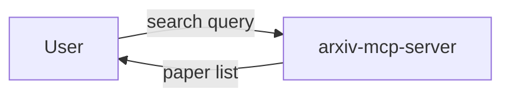

**Code**:
```python
papers = arxiv.search("quantum computing", max_results=10)
```

### Example 0.2: Basic Screenshot
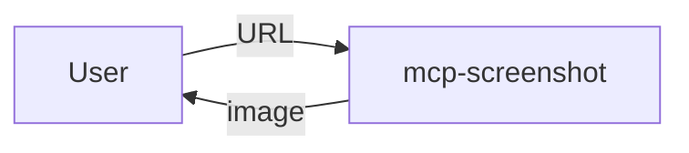

**Code**:
```python
screenshot = mcp_screenshot.capture("https://example.com")
```

---

## 🔗 Level 1 Examples (Sequential Chains)

### Example 1.1: Research Paper Analysis Pipeline
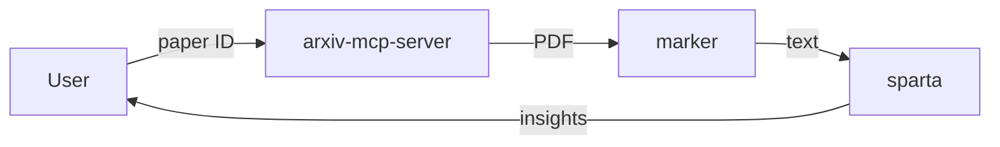

**Flow**:
1. Fetch PDF from ArXiv
2. Extract text with Marker
3. Analyze with Sparta
4. Return insights

**Code**:
```python
# Sequential execution
pdf = await arxiv.fetch_pdf(paper_id)
text = await marker.extract_text(pdf)
analysis = await sparta.analyze(text)
return analysis
```

### Example 1.2: Video Learning Pipeline
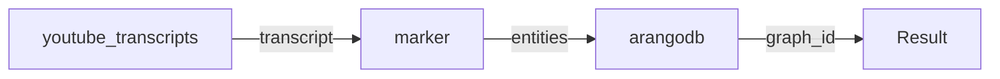

**Flow**:
1. Get video transcript
2. Extract key entities
3. Store in knowledge graph
4. Return graph reference

---

## 🔀 Level 2 Examples (Parallel & Branching)

### Example 2.1: Multi-Source Research Aggregation
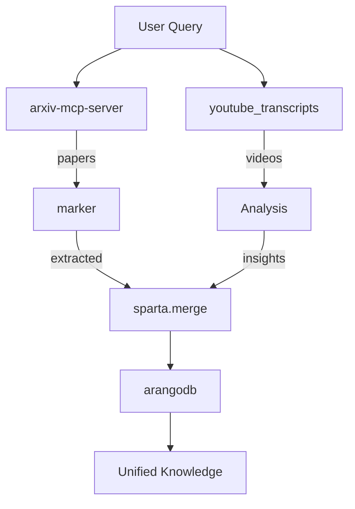

**Code**:
```python
# Parallel execution
async def multi_source_research(query):
    # Launch parallel searches
    papers_task = arxiv.search(query)
    videos_task = youtube.search(query)
    
    # Wait for both
    papers, videos = await asyncio.gather(papers_task, videos_task)
    
    # Process in parallel
    extract_task = marker.batch_extract(papers)
    analyze_task = youtube.analyze_batch(videos)
    
    extracted, analyzed = await asyncio.gather(extract_task, analyze_task)
    
    # Merge and store
    merged = await sparta.merge_knowledge(extracted, analyzed)
    graph_id = await arangodb.store(merged)
    
    return graph_id
```

### Example 2.2: Conditional Document Processing
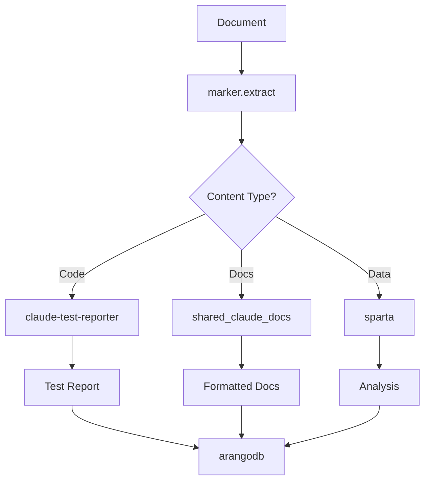

---

## 🎭 Level 3 Examples (Orchestrated Systems)

### Example 3.1: Self-Improving Research System
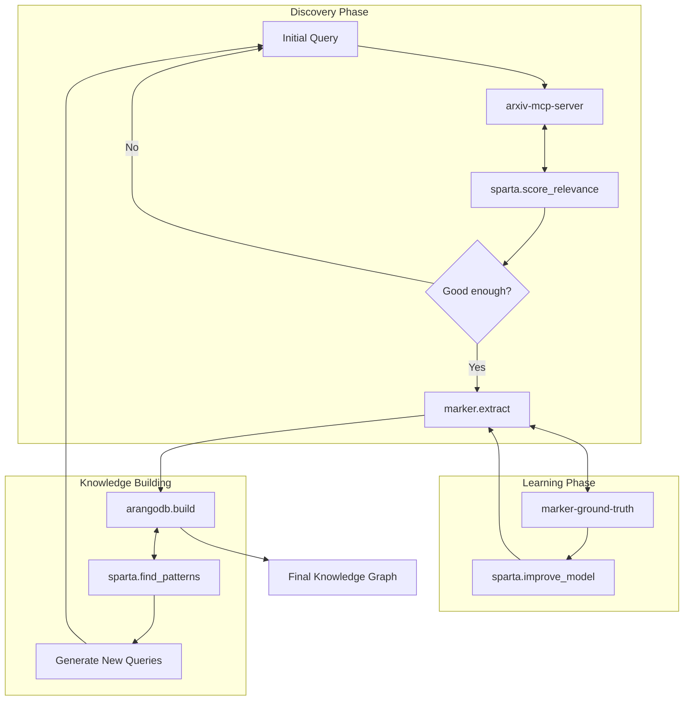

**Orchestration Logic**:
```python
class ResearchOrchestrator:
    async def run(self, initial_query):
        query = initial_query
        iterations = 0
        knowledge_graph = KnowledgeGraph()
        
        while iterations < MAX_ITERATIONS:
            # Discovery with feedback
            papers = await self.discover_relevant_papers(query)
            
            # Extraction with learning
            extracted = await self.extract_with_improvement(papers)
            
            # Knowledge building
            knowledge_graph.add(extracted)
            patterns = await knowledge_graph.find_patterns()
            
            # Generate new queries from patterns
            new_queries = await self.generate_queries(patterns)
            if not new_queries:
                break
                
            query = new_queries[0]
            iterations += 1
        
        return knowledge_graph
```

### Example 3.2: Real-time Adaptive Documentation
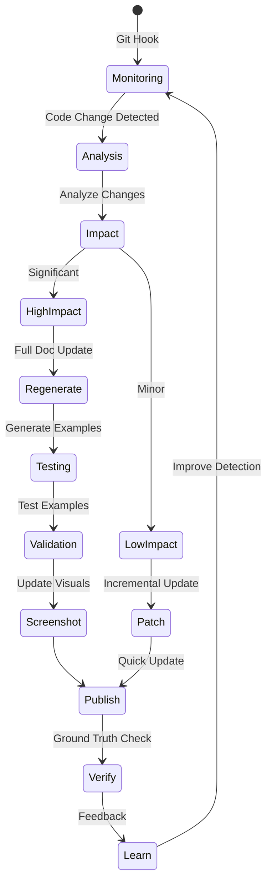

### Example 3.3: Intelligent Training Orchestra
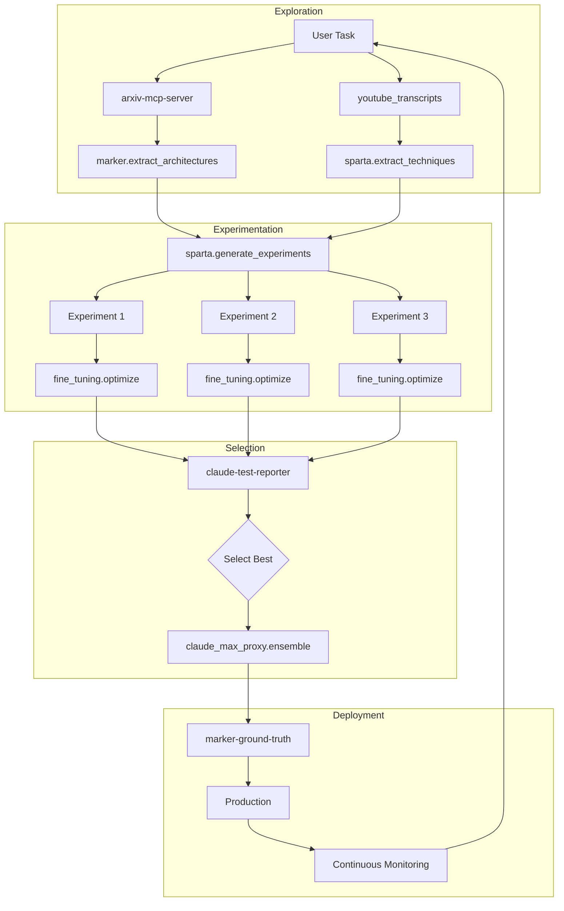

---

## 🎯 Interaction Complexity Comparison

### Simple Query (Level 0)
```
Time: ~1 second
Modules: 1
Complexity: O(1)
```

### Pipeline Query (Level 1)
```
Time: ~5 seconds
Modules: 3-4
Complexity: O(n)
```

### Parallel Query (Level 2)
```
Time: ~3 seconds (parallel)
Modules: 4-6
Complexity: O(log n)
```

### Orchestrated Query (Level 3)
```
Time: Variable (adaptive)
Modules: 6-12
Complexity: O(n × iterations)
```

---

## 💡 Best Practices Illustrated

### DO: Start Simple
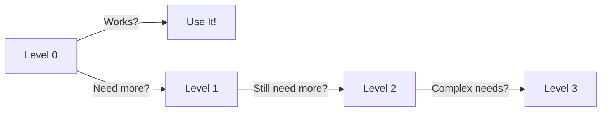

### DON'T: Over-Engineer
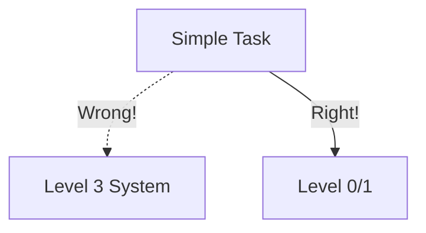

### DO: Clear Error Handling
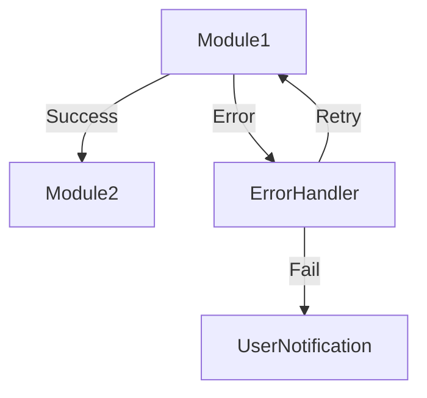

---

## 🔧 Debugging Workflows

### Level 1 Debugging
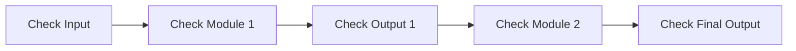

### Level 3 Debugging
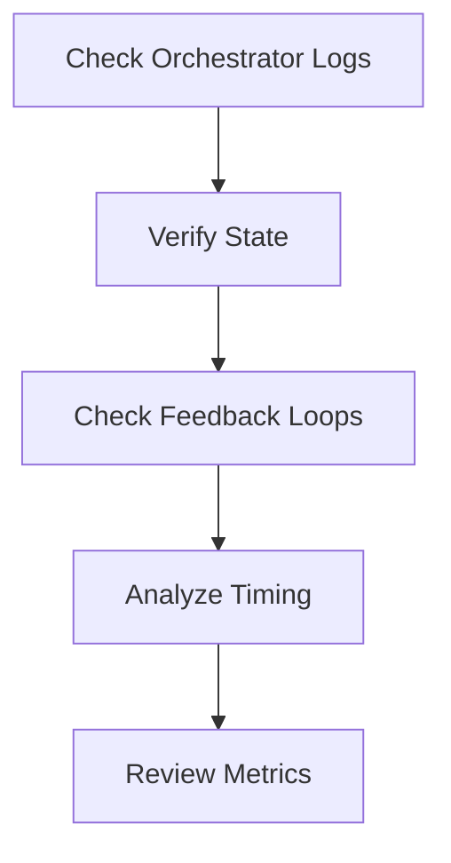

---

*These visual examples demonstrate the progression from simple to complex module interactions. Use them as templates for designing your own workflows.*