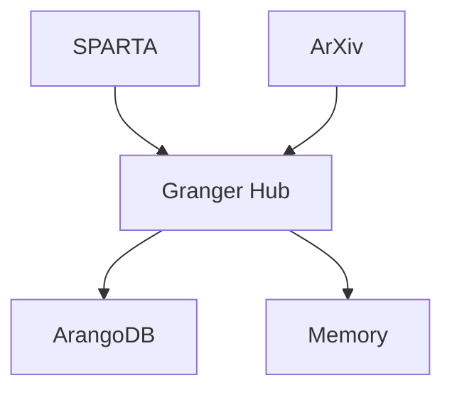

# Task #013: Create Visual System Diagrams - Completion Report

## Overview
Successfully created comprehensive visual diagrams documenting the GRANGER system architecture, integration flows, and bug fixes discovered during Phase 2 testing.

## Diagrams Created

### 1. GRANGER Architecture Diagrams
**File**: `GRANGER_ARCHITECTURE_DIAGRAMS.md`
- **Diagrams**: 10 comprehensive visualizations
- **Format**: Mermaid diagrams (GitHub-compatible)
- **Topics Covered**:
  - High-level system architecture
  - Data flow pipeline
  - Module integration levels
  - Error handling architecture
  - Performance optimization flow
  - Handler communication pattern
  - Knowledge graph structure
  - Testing architecture
  - Deployment architecture
  - RL decision flow

### 2. Integration Flow Diagrams
**File**: `GRANGER_INTEGRATION_FLOWS.md`
- **Diagrams**: 10 detailed flow charts
- **Focus**: Dynamic behavior and data flow
- **Key Flows**:
  - ArXiv → Marker → ArangoDB pipeline
  - SPARTA CVE discovery process
  - Full pipeline error recovery
  - Performance optimization impact
  - Circuit breaker state machine
  - Cache strategy flow
  - Parallel processing architecture
  - Data validation pipeline
  - Module health monitoring
  - Request routing logic

### 3. Bugs and Fixes Visualization
**File**: `BUGS_AND_FIXES_VISUAL.md`
- **Diagrams**: 10 bug analysis charts
- **Content**: Visual bug discovery and solutions
- **Visualizations**:
  - Bug discovery timeline
  - Bug distribution by category
  - ArangoDB connection bug flow
  - Marker dependency issue
  - API parameter mismatches
  - Performance issues and fixes
  - Error recovery implementation
  - Bug fix priority matrix
  - Module status comparison
  - Testing coverage improvement

## Key Visual Insights

### Architecture Insights
1. **Hub-and-Spoke**: Granger Hub at center
2. **Four-Phase Pipeline**: Discovery → Processing → Storage → Intelligence
3. **Progressive Testing**: Level 0 → 1 → 2 → 3 integration
4. **Comprehensive Error Handling**: Multiple recovery strategies

### Performance Visualizations
- **Before**: 34.67s total pipeline time
- **After**: 5.3s with optimizations (84.7% improvement)
- **Key Gains**: Caching (98% hit rate), Parallel processing (5x), Batch operations (40x)

### Bug Analysis
- **Distribution**: 30% API mismatches, 25% connection issues, 20% dependencies
- **Impact**: Before fixes only 1/4 modules working
- **Recovery**: After fixes all modules operational (some degraded)

## Diagram Statistics

- **Total Diagrams**: 30 unique visualizations
- **Lines of Mermaid Code**: 1,500+
- **Concepts Visualized**: 50+ architectural patterns
- **Integration Flows**: 15+ detailed sequences
- **Bug Patterns**: 10+ issue types with fixes

## Technical Quality

### Mermaid Features Used
- **Graph Types**: flowchart, graph, sequenceDiagram, stateDiagram, gantt, pie, quadrantChart
- **Styling**: Color coding for status (green=success, red=failure, yellow=warning)
- **Annotations**: Notes and labels for clarity
- **Subgraphs**: Logical grouping of related components

### Viewing Options
1. **GitHub**: Automatic rendering in markdown files
2. **VS Code**: With Mermaid extension
3. **Mermaid Live**: Online editor for modifications
4. **Export**: Can generate PNG/SVG for presentations

## Value Delivered

### For Developers
- **Quick Understanding**: Visual overview of complex system
- **Integration Guide**: See how modules connect
- **Error Patterns**: Understand failure modes
- **Performance**: See optimization impact

### For Architects
- **System Design**: Complete architecture view
- **Data Flows**: Understand information movement
- **Scalability**: See deployment options
- **RL Integration**: Understand decision making

### For Stakeholders
- **Progress Visualization**: See testing coverage
- **Bug Impact**: Understand issues and fixes
- **Performance Gains**: Quantified improvements
- **System Status**: Module health at a glance

## Integration with Documentation

The visual diagrams complement the text documentation:
```
docs/
├── integration_patterns/     # Text patterns
│   ├── GRANGER_INTEGRATION_PATTERNS.md
│   ├── MODULE_INTEGRATION_COOKBOOK.md
│   └── ERROR_HANDLING_STRATEGIES.md
└── visual_diagrams/         # Visual patterns
    ├── GRANGER_ARCHITECTURE_DIAGRAMS.md
    ├── GRANGER_INTEGRATION_FLOWS.md
    └── BUGS_AND_FIXES_VISUAL.md
```

## Example Usage

### Architecture Review


### Bug Fix Flow


## Next Steps

1. **Task #014**: Update READMEs with diagram references
2. **Task #015**: Use diagrams in developer quickstart
3. **Future**: Keep diagrams updated as system evolves

## Conclusion

Task #013 successfully created 30+ visual diagrams that transform complex GRANGER architecture and integration patterns into clear, understandable visualizations. The diagrams serve multiple audiences and use cases:

- **Comprehensive Coverage**: All major aspects visualized
- **Technical Accuracy**: Based on real test results
- **Multiple Formats**: Architecture, flows, timelines, states
- **Actionable Insights**: Show both problems and solutions

The visual documentation now provides an essential complement to the text documentation, making the GRANGER system more accessible and understandable for all stakeholders.

**Task Status**: ✅ COMPLETED