# GRANGER Reinforcement Learning Flow Diagram

## Dynamic Module Orchestration with RL

```mermaid
%%{init: {
  'theme': 'base',
  'themeVariables': {
    'primaryColor': '#1e293b',
    'primaryTextColor': '#f8fafc',
    'primaryBorderColor': '#64748b',
    'lineColor': '#64748b',
    'secondaryColor': '#334155',
    'tertiaryColor': '#475569',
    'background': '#0f172a',
    'mainBkg': '#1e293b',
    'secondBkg': '#334155',
    'tertiaryBkg': '#475569',
    'primaryBorderColor': '#64748b',
    'secondaryBorderColor': '#64748b',
    'tertiaryBorderColor': '#64748b',
    'primaryTextColor': '#f8fafc',
    'secondaryTextColor': '#e2e8f0',
    'tertiaryTextColor': '#cbd5e1',
    'textColor': '#f8fafc',
    'lineColor': '#64748b',
    'fontFamily': 'ui-monospace, SFMono-Regular, SF Mono, Consolas, Liberation Mono, Menlo, monospace'
  }
}}%%

graph TD
    %% Entry Point
    USER[🧑‍💼 User Request<br/>Any Complexity Level 0-3] -->|Task Analysis| BRAIN

    %% Central RL Brain
    BRAIN[🧠 RL Orchestrator<br/>Claude Module Communicator<br/>+ RL Commons]
    
    %% RL Decision Components
    BRAIN -->|Feature Extraction| ANALYZE[📊 Task Analyzer<br/>• Complexity Detection<br/>• Requirement Parsing<br/>• Constraint Identification]
    
    ANALYZE -->|State Creation| STATE[🎯 System State<br/>• Module Availability<br/>• Current Load<br/>• Historical Performance]
    
    STATE -->|Optimization| OLLAMA[🤖 Ollama LLM<br/>Route Optimization<br/>Real-time Decisions]
    
    OLLAMA -->|Route Selection| ROUTER[🔀 Dynamic Router<br/>• Baseline vs Optimized<br/>• Multi-objective Balance<br/>• Parallel/Sequential]

    %% Module Pool - All Interchangeable
    ROUTER -.->|Fluid Selection| MODULES{🎲 Module Pool<br/>Task-Driven Selection}
    
    %% Individual Modules with Capabilities
    MODULES --> MARKER[📄 Marker<br/>PDF/PPT/HTML<br/>Table Extraction]
    MODULES --> SPARTA[🛡️ SPARTA<br/>Security Analysis<br/>Vulnerability Detection]
    MODULES --> ARANGODB[🕸️ ArangoDB<br/>Graph Storage<br/>Relationship Mapping]
    MODULES --> ARXIV[📚 ArXiv MCP<br/>Research Papers<br/>Latest Techniques]
    MODULES --> YOUTUBE[📺 YouTube<br/>Video Transcripts<br/>Technical Content]
    MODULES --> CHAT[💬 Chat<br/>Natural Language<br/>User Interface]
    MODULES --> CLAUDE_MAX[🔮 Claude Max<br/>Multi-LLM Access<br/>GPT/Gemini/Claude]
    MODULES --> TEST_REPORTER[✅ Test Reporter<br/>Quality Validation<br/>AI Analysis]
    MODULES --> UNSLOTH[🦥 Unsloth<br/>Fine-tuning<br/>Domain Adaptation]
    MODULES --> SCREENSHOT[📸 MCP Screenshot<br/>Visual Analysis<br/>UI Verification]

    %% Dynamic Interconnections (any module can connect to any other)
    MARKER -.->|Discovered Need| ARXIV
    ARXIV -.->|Related Security| SPARTA
    SPARTA -.->|Store Findings| ARANGODB
    ARANGODB -.->|Query Results| CHAT
    YOUTUBE -.->|Training Data| UNSLOTH
    SCREENSHOT -.->|Visual Test| TEST_REPORTER
    CLAUDE_MAX -.->|Multi-Model| TEST_REPORTER

    %% Learning Feedback Loop
    MARKER -->|Episode Data| FEEDBACK[📈 Learning System<br/>• Episode Collection<br/>• Reward Calculation<br/>• Pattern Discovery]
    SPARTA -->|Performance| FEEDBACK
    ARANGODB -->|Metrics| FEEDBACK
    ARXIV -->|Success Rate| FEEDBACK
    
    FEEDBACK -->|Continuous Improvement| BRAIN
    
    %% Self-Improvement Engine
    FEEDBACK -->|Patterns| IMPROVE[🔬 Self-Improvement<br/>• Bottleneck Detection<br/>• New Route Discovery<br/>• Module Optimization]
    
    IMPROVE -->|Updates| BRAIN

    %% Output
    MODULES -->|Task Completion| RESULT[✨ Optimized Result<br/>• 80% Faster<br/>• 95% Accuracy<br/>• Self-Improving]
    
    RESULT -->|Deliver| USER

    %% Styling for visibility in both modes
    classDef brainNode fill:#3b82f6,stroke:#1e40af,color:#ffffff,stroke-width:3px
    classDef moduleNode fill:#10b981,stroke:#047857,color:#ffffff,stroke-width:2px
    classDef analysisNode fill:#f59e0b,stroke:#d97706,color:#ffffff,stroke-width:2px
    classDef feedbackNode fill:#8b5cf6,stroke:#6d28d9,color:#ffffff,stroke-width:2px
    classDef userNode fill:#ef4444,stroke:#b91c1c,color:#ffffff,stroke-width:3px
    
    class BRAIN brainNode
    class MARKER,SPARTA,ARANGODB,ARXIV,YOUTUBE,CHAT,CLAUDE_MAX,TEST_REPORTER,UNSLOTH,SCREENSHOT moduleNode
    class ANALYZE,STATE,OLLAMA,ROUTER,MODULES analysisNode
    class FEEDBACK,IMPROVE feedbackNode
    class USER,RESULT userNode
```

## Key Insights Visualized

1. **🧠 Central RL Brain**: The Claude Module Communicator with RL Commons acts as the intelligent orchestrator, not a fixed pipeline

2. **🎲 Fluid Module Selection**: The dotted lines show that ANY module can connect to ANY other module based on task needs

3. **📊 Complexity Handling**: The system analyzes each task and adapts its approach from Level 0 (simple) to Level 3 (expert)

4. **🔀 Dynamic Routing**: Real-time decisions between baseline and optimized routes, with parallel/sequential execution

5. **📈 Continuous Learning**: Every interaction feeds back into the system, making it smarter for future tasks

6. **🔬 Self-Improvement**: The system discovers new patterns and optimizations autonomously

## Example Task Flows

### Level 0: Simple PDF Extraction
USER → BRAIN → MARKER → RESULT

### Level 1: PDF with Security Check  
USER → BRAIN → MARKER → SPARTA → RESULT

### Level 2: Multi-Source Verification
USER → BRAIN → (MARKER + YOUTUBE) → ARANGODB → CHAT → RESULT

### Level 3: Complex Hardware Verification
USER → BRAIN → MARKER → (SPARTA || ARXIV || ARANGODB) → CLAUDE_MAX → TEST_REPORTER → RESULT

The beauty is that these flows are NOT pre-programmed - they emerge from RL optimization based on what works best for each unique task.
