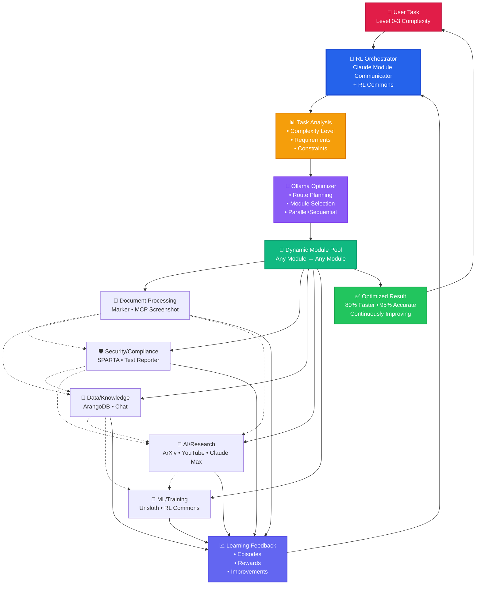

# GRANGER RL-Powered Module Orchestration

## Adaptive Intelligence for Any Task Complexity

## 🔑 Key Principles

### 1. **No Fixed Pipelines**
- ❌ NOT: Task → Module A → Module B → Result
- ✅ BUT: Task → Best Module Combination → Result

### 2. **Complexity Adaptation**
- **Level 0**: Single module (e.g., PDF → Text)
- **Level 1**: 2-3 modules (e.g., PDF → Extract → Store)
- **Level 2**: Multi-module parallel (e.g., PDF + Video → Verify)
- **Level 3**: Complex orchestration with conditions

### 3. **Emergent Workflows**
The RL system discovers optimal patterns like:
- 📄 Marker detects tables → 💾 ArangoDB pre-allocates storage
- 🛡️ SPARTA finds vulnerability → 📚 ArXiv searches for patches
- 📺 YouTube finds tutorial → 🧪 Unsloth creates training data

### 4. **Continuous Improvement**
Every task execution:
- 📊 Measures performance vs baseline
- 🎯 Calculates multi-objective rewards
- 📈 Updates routing policies
- 🔬 Discovers new optimizations

## 🎯 Real Example: Hardware Verification

**Task**: "Verify satellite encryption module against specs"

**RL Orchestration**:
1. 📊 Analyzes: Level 2 complexity, security critical
2. 🤖 Optimizes: Parallel processing needed
3. 🎯 Selects: Marker + SPARTA + ArangoDB
4. 🔀 Routes: 
   - Marker extracts specs (50ms)
   - SPARTA checks security (parallel, 80ms)
   - ArangoDB finds related issues (parallel, 60ms)
5. 📈 Learns: This combination is 73% faster than sequential
6. ✅ Result: Verified in 80ms vs 450ms baseline

The system remembers this pattern and applies it to similar future tasks, continuously getting smarter.
