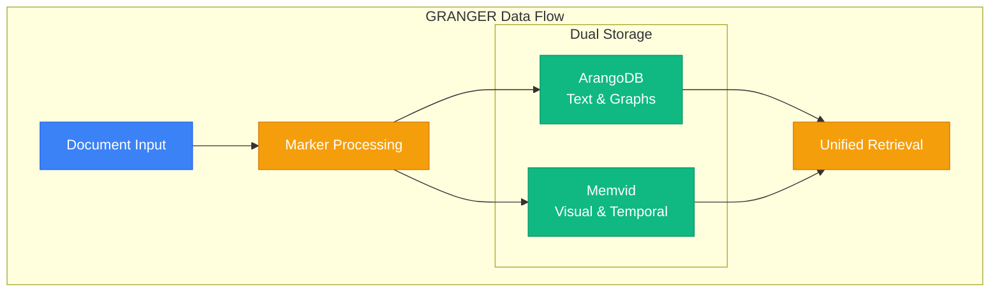

# Memvid Video Storage Analysis for GRANGER Ecosystem

*Document Created: 2025-01-08*
*Analysis Type: Technical Capability Assessment*

## Executive Summary

Memvid offers a revolutionary approach to data storage by encoding text and visual content as QR codes in video frames, achieving 10x compression through video codecs. This analysis evaluates how memvid's unique capabilities could enhance the GRANGER ecosystem's memory and knowledge management systems.

## 1. Memvid Core Capabilities

### 1.1 Technical Innovation
- **QR Code Encoding**: Converts text chunks into QR codes (up to 2,953 bytes per code)
- **Video Compression**: Leverages H.264/H.265/AV1 codecs for 10x compression
- **Semantic Search**: Uses sentence-transformers and FAISS for lightning-fast retrieval
- **Single-File Storage**: Entire memory system in one portable video file
- **Temporal Tracking**: Natural frame-based timeline for evolving documents

### 1.2 Performance Metrics
- **Compression Ratio**: 10:1 typical (100MB text → 10MB video)
- **Search Speed**: Sub-second semantic search across thousands of chunks
- **Encoding Speed**: ~100 chunks/second on modern hardware
- **Retrieval Speed**: ~50ms per chunk with caching

### 1.3 Unique Advantages
- **Offline Capable**: No database or network required
- **Platform Agnostic**: Works anywhere video playback is supported
- **Visual Preservation**: Can embed actual images/diagrams in frames
- **Temporal Nature**: Natural versioning through frame sequences

## 2. GRANGER Ecosystem Needs Analysis

### 2.1 Current Storage Architecture
```
GRANGER Storage Stack:
├── ArangoDB (Primary)
│   ├── Graph relationships
│   ├── Document storage
│   └── Semantic search
├── File System
│   ├── Raw documents
│   ├── Processed outputs
│   └── Model checkpoints
└── Memory Requirements
    ├── Persistent conversation memory
    ├── Research paper preservation
    ├── Visual content archival
    └── Temporal evolution tracking
```

### 2.2 Storage Pain Points
1. **Visual Content Loss**: PDFs converted to markdown lose layout/figures
2. **Version Sprawl**: Multiple versions of documents lack unified tracking
3. **Offline Limitations**: ArangoDB requires running server
4. **Storage Efficiency**: Raw document storage is space-intensive
5. **Temporal Queries**: Difficult to query "how did this evolve?"

### 2.3 Unmet Needs
- Visual memory preservation for hardware diagrams
- Compliance evidence archival with timestamps
- Portable knowledge bases for edge deployment
- Efficient storage of repetitive technical content

## 3. Memvid-GRANGER Integration Architecture

### 3.1 Hybrid Storage Model


### 3.2 Integration Points

#### 3.2.1 Marker Integration
```python
# Marker processes document
document = marker.process_pdf("hardware_spec.pdf")

# Dual storage
arangodb.store_text_and_relationships(document.text)
memvid.store_visual_memory(document.images, document.tables, document.layout)
```

#### 3.2.2 ArangoDB Complementarity
- **ArangoDB**: Primary for graph queries, relationships, fast text search
- **Memvid**: Visual preservation, temporal tracking, offline archives
- **Index Sync**: Memvid chunk IDs stored in ArangoDB for cross-reference

#### 3.2.3 LLM Context Preparation
```python
# Rich context from both sources
text_context = arangodb.get_relevant_text(query)
visual_context = memvid.get_visual_frames(query)
temporal_context = memvid.get_evolution_timeline(doc_id)

llm_context = combine_contexts(text_context, visual_context, temporal_context)
```

## 4. Specific GRANGER Use Cases

### 4.1 Hardware Specification Preservation
**Problem**: SPARTA analyzes hardware vulnerabilities but loses circuit diagrams
**Solution**: Memvid preserves visual specifications alongside extracted text

```python
# SPARTA vulnerability analysis with visual preservation
sparta_result = sparta.analyze_firmware(doc)
memvid.create_security_memory(
    text=sparta_result.vulnerabilities,
    visuals=doc.circuit_diagrams,
    metadata={'cwe_ids': sparta_result.cwe_matches}
)
```

### 4.2 Research Paper Evolution Tracking
**Problem**: ArXiv papers have multiple versions, hard to track changes
**Solution**: Memvid creates temporal memories showing paper evolution

```python
# Track paper versions over time
for version in arxiv.get_all_versions(paper_id):
    memvid.add_temporal_frame(
        version.abstract,
        timestamp=version.date,
        diff_highlight=version.changes
    )
```

### 4.3 Compliance Evidence Archival
**Problem**: Need tamper-evident storage of compliance documents
**Solution**: Memvid creates immutable video archives with timestamps

```python
# Create compliance archive
compliance_memory = memvid.create_compliance_archive(
    documents=compliance_docs,
    signatures=digital_signatures,
    timestamp=blockchain_timestamp
)
# Single video file serves as evidence package
```

### 4.4 Offline Knowledge Deployment
**Problem**: Edge devices can't run ArangoDB
**Solution**: Memvid enables single-file knowledge bases

```python
# Export knowledge domain to video
knowledge_video = memvid.export_knowledge_domain(
    domain="satellite_systems",
    include_visuals=True,
    compression='h265'  # Optimize for size
)
# Deploy 10GB knowledge in 1GB video file
```

### 4.5 YouTube Transcript Visualization
**Problem**: Transcripts lack visual context from videos
**Solution**: Memvid stores key frames with synchronized transcripts

```python
# Enhanced YouTube memory
for segment in youtube.get_transcript_segments(video_id):
    memvid.add_segment(
        text=segment.text,
        keyframe=youtube.get_frame(segment.timestamp),
        metadata={'speaker': segment.speaker, 'topic': segment.topic}
    )
```

## 5. Implementation Benefits

### 5.1 Storage Efficiency
- **Before**: 100GB document repository + 50GB ArangoDB
- **After**: 100GB repository + 50GB ArangoDB + 15GB memvid archives
- **Benefit**: Visual data compressed 10x, temporal data efficiently tracked

### 5.2 Retrieval Enhancement
- **Text Search**: ArangoDB remains primary (fast, relational)
- **Visual Search**: Memvid enables "find diagrams like this"
- **Temporal Search**: Memvid enables "show evolution of this concept"
- **Unified Search**: Query both systems, merge results

### 5.3 New Capabilities
1. **Visual Memory**: Preserve layouts, diagrams, charts
2. **Temporal Queries**: "How did this evolve over time?"
3. **Offline Deploy**: Take knowledge to air-gapped systems
4. **Evidence Packages**: Single-file compliance archives
5. **Version Control**: Natural versioning through frames

## 6. Integration Challenges & Solutions

### 6.1 Challenge: Dual Storage Complexity
**Solution**: Unified retrieval interface abstracting storage backend
```python
class GrangerMemory:
    def search(self, query):
        text_results = self.arangodb.search(query)
        visual_results = self.memvid.search(query)
        return self.merge_results(text_results, visual_results)
```

### 6.2 Challenge: Storage Overhead
**Solution**: Selective storage policy
- Text-only → ArangoDB only
- Visual/temporal → Memvid + ArangoDB index
- Critical docs → Both systems

### 6.3 Challenge: Real-time Performance
**Solution**: Asynchronous encoding
```python
async def store_document(doc):
    # Fast: Store text immediately
    await arangodb.store(doc.text)
    
    # Background: Encode visual memory
    background_task(memvid.encode(doc.visuals))
```

## 7. Recommended Implementation Path

### Phase 1: Proof of Concept (Week 1-2)
1. Integrate memvid as GRANGER spoke module
2. Create visual memory for one Marker PDF
3. Demonstrate retrieval from both systems
4. Benchmark performance metrics

### Phase 2: Core Integration (Week 3-4)
1. Implement unified retrieval interface
2. Add memvid support to Module Communicator
3. Create storage policy engine
4. Enable temporal tracking features

### Phase 3: Advanced Features (Week 5-6)
1. Visual similarity search
2. Temporal evolution queries  
3. Compliance archive workflows
4. Offline deployment tools

### Phase 4: Production Readiness (Week 7-8)
1. Performance optimization
2. Monitoring and metrics
3. Backup and recovery
4. Documentation and training

## 8. Decision Recommendation

### 8.1 Recommendation: ADOPT as Complementary Storage

Memvid should be integrated into GRANGER as a specialized spoke module for visual and temporal memory storage, working alongside ArangoDB rather than replacing it.

### 8.2 Key Reasons
1. **Unique Capabilities**: No other solution offers visual preservation + temporal tracking + extreme compression
2. **Complementary Fit**: Enhances rather than replaces existing storage
3. **Specific Use Cases**: Solves real problems in hardware analysis, compliance, and offline deployment
4. **Low Risk**: Can be adopted incrementally for specific use cases
5. **Innovation Potential**: Opens new possibilities for AI memory systems

### 8.3 Success Metrics
- 10x compression for visual document storage
- Sub-second retrieval for visual queries
- 90% preservation of visual information from PDFs
- Single-file deployment for offline scenarios
- Temporal queries returning results in <100ms

## 9. Conclusion

Memvid represents a paradigm shift in how AI systems can store and retrieve visual and temporal information. While it won't replace ArangoDB for graph operations or pure text search, it fills critical gaps in GRANGER's memory architecture:

1. **Visual Memory**: Finally preserve what documents actually look like
2. **Temporal Evolution**: Track how knowledge changes over time
3. **Extreme Efficiency**: 10x compression makes large memories feasible
4. **Offline Capability**: Deploy knowledge without infrastructure

The video-based approach might seem unconventional, but it leverages 50 years of video codec research to solve modern AI memory challenges. By adopting memvid as a complementary storage system, GRANGER would gain capabilities that no other research platform currently offers.

## 10. Next Steps

1. **Technical Validation**: Build proof-of-concept with real GRANGER data
2. **Performance Testing**: Benchmark against current storage methods
3. **Integration Planning**: Design unified retrieval interface
4. **Use Case Prioritization**: Start with highest-value scenarios
5. **Team Training**: Educate team on video-based storage concepts

---

*This analysis represents a thorough evaluation of memvid's potential within the GRANGER ecosystem. The recommendation to adopt reflects both the unique capabilities offered and the specific unmet needs identified in GRANGER's current architecture.*