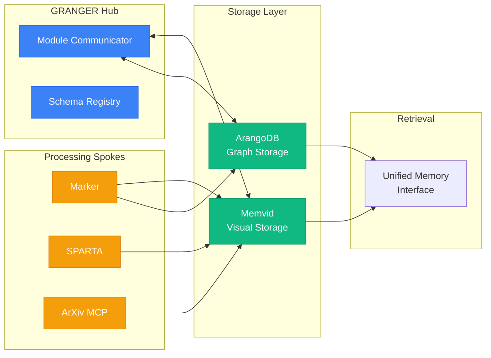

# Memvid GRANGER Integration Guide

*Document Created: 2025-01-08*
*Integration Type: Spoke Module*

## Overview

This guide provides step-by-step instructions for integrating memvid as a spoke module in the GRANGER ecosystem, enabling video-based visual and temporal memory storage alongside ArangoDB.

## 1. Architecture Overview

### 1.1 Integration Architecture


### 1.2 Communication Flow
1. **Registration**: Memvid registers with Module Communicator
2. **Schema Exchange**: Memvid publishes storage capabilities
3. **Storage Requests**: Other modules request visual storage
4. **Retrieval**: Unified interface queries both storage systems

## 2. Module Setup

### 2.1 Directory Structure
```bash
/home/graham/workspace/experiments/memvid/
├── src/
│   └── memvid/
│       ├── core/           # Business logic
│       ├── cli/            # CLI interface
│       ├── mcp/            # MCP server
│       └── granger/        # GRANGER integration
│           ├── __init__.py
│           ├── spoke.py    # Module Communicator interface
│           ├── schemas.py  # GRANGER schemas
│           └── unified.py  # Unified retrieval
├── tests/
├── docs/
└── pyproject.toml
```

### 2.2 GRANGER Integration Layer

#### 2.2.1 Spoke Interface (`spoke.py`)
```python
"""
Module: spoke.py
Description: Memvid spoke interface for GRANGER Module Communicator

External Dependencies:
- granger_hub: https://github.com/grahama1970/granger_hub

Sample Input:
>>> spoke = MemvidSpoke()
>>> spoke.store_visual_memory(document_id, images, metadata)

Expected Output:
>>> {"status": "success", "memory_id": "mem_12345", "video_path": "memories/doc_12345.mp4"}
"""

from typing import Dict, Any, List, Optional
from pathlib import Path
import asyncio
from loguru import logger

from granger_hub import ModuleCommunicator, SpokeModule
from memvid.core import MemvidEncoder, MemvidRetriever


class MemvidSpoke(SpokeModule):
    """Memvid spoke module for GRANGER visual memory storage."""
    
    def __init__(self, storage_path: str = "./memories"):
        """Initialize Memvid spoke."""
        super().__init__(
            module_name="memvid",
            module_type="storage",
            version="0.2.0"
        )
        
        self.storage_path = Path(storage_path)
        self.storage_path.mkdir(exist_ok=True)
        
        # Register capabilities
        self.capabilities = {
            "visual_storage": True,
            "temporal_tracking": True,
            "semantic_search": True,
            "offline_capable": True,
            "compression_ratio": 10,
            "supported_formats": ["pdf", "image", "video", "text"]
        }
        
        logger.info(f"Memvid spoke initialized at {storage_path}")
    
    async def handle_request(self, request: Dict[str, Any]) -> Dict[str, Any]:
        """Handle incoming requests from Module Communicator."""
        action = request.get("action")
        
        if action == "store_visual":
            return await self._store_visual_memory(request)
        elif action == "search":
            return await self._search_memories(request)
        elif action == "get_statistics":
            return await self._get_statistics(request)
        elif action == "create_temporal":
            return await self._create_temporal_memory(request)
        else:
            return {"status": "error", "message": f"Unknown action: {action}"}
    
    async def _store_visual_memory(self, request: Dict[str, Any]) -> Dict[str, Any]:
        """Store visual content as video memory."""
        try:
            document_id = request["document_id"]
            visuals = request.get("visuals", [])
            text_chunks = request.get("text_chunks", [])
            metadata = request.get("metadata", {})
            
            # Create encoder
            encoder = MemvidEncoder()
            
            # Add chunks with visuals
            for i, (text, visual) in enumerate(zip(text_chunks, visuals)):
                encoder.add_chunk({
                    "id": f"{document_id}_chunk_{i}",
                    "text": text,
                    "visual": visual,
                    "metadata": {
                        **metadata,
                        "chunk_index": i,
                        "source_module": request.get("source_module", "unknown")
                    }
                })
            
            # Build video memory
            video_path = self.storage_path / f"{document_id}.mp4"
            await asyncio.get_event_loop().run_in_executor(
                None, encoder.build, str(video_path)
            )
            
            # Store reference in ArangoDB
            await self._notify_arangodb({
                "action": "store_reference",
                "document_id": document_id,
                "memvid_path": str(video_path),
                "chunk_count": len(text_chunks),
                "metadata": metadata
            })
            
            return {
                "status": "success",
                "memory_id": document_id,
                "video_path": str(video_path),
                "chunks_stored": len(text_chunks),
                "file_size": video_path.stat().st_size
            }
            
        except Exception as e:
            logger.error(f"Failed to store visual memory: {e}")
            return {"status": "error", "message": str(e)}
    
    async def _search_memories(self, request: Dict[str, Any]) -> Dict[str, Any]:
        """Search across video memories."""
        try:
            query = request["query"]
            limit = request.get("limit", 10)
            include_visuals = request.get("include_visuals", False)
            
            results = []
            
            # Search all memory files
            for memory_file in self.storage_path.glob("*.mp4"):
                retriever = MemvidRetriever(str(memory_file))
                
                # Semantic search
                chunks = await asyncio.get_event_loop().run_in_executor(
                    None, retriever.search, query, limit
                )
                
                for chunk in chunks:
                    result = {
                        "memory_id": memory_file.stem,
                        "chunk_id": chunk["id"],
                        "text": chunk["text"],
                        "score": chunk["score"],
                        "metadata": chunk.get("metadata", {})
                    }
                    
                    if include_visuals and chunk.get("visual"):
                        result["visual"] = chunk["visual"]
                    
                    results.append(result)
            
            # Sort by score
            results.sort(key=lambda x: x["score"], reverse=True)
            
            return {
                "status": "success",
                "results": results[:limit],
                "total_searched": len(list(self.storage_path.glob("*.mp4")))
            }
            
        except Exception as e:
            logger.error(f"Search failed: {e}")
            return {"status": "error", "message": str(e)}
    
    async def _notify_arangodb(self, data: Dict[str, Any]) -> None:
        """Notify ArangoDB of new visual memory."""
        await self.communicator.send_to_module("arangodb", data)
    
    def get_schemas(self) -> Dict[str, Any]:
        """Return GRANGER communication schemas."""
        return {
            "store_visual": {
                "type": "object",
                "required": ["document_id"],
                "properties": {
                    "document_id": {"type": "string"},
                    "visuals": {"type": "array"},
                    "text_chunks": {"type": "array"},
                    "metadata": {"type": "object"}
                }
            },
            "search": {
                "type": "object",
                "required": ["query"],
                "properties": {
                    "query": {"type": "string"},
                    "limit": {"type": "integer", "default": 10},
                    "include_visuals": {"type": "boolean", "default": False}
                }
            }
        }
```

#### 2.2.2 Unified Retrieval (`unified.py`)
```python
"""
Module: unified.py
Description: Unified memory retrieval across ArangoDB and Memvid

External Dependencies:
- arangodb: GRANGER graph database module
- memvid: Video-based memory storage

Sample Input:
>>> unified = UnifiedMemory()
>>> results = unified.search("satellite vulnerability diagram")

Expected Output:
>>> [
...     {"source": "arangodb", "type": "text", "content": "...", "score": 0.95},
...     {"source": "memvid", "type": "visual", "content": <image>, "score": 0.92}
... ]
"""

from typing import Dict, Any, List, Optional
import asyncio
from loguru import logger

# These would be imported from actual modules
# from arangodb import ArangoSearcher
# from memvid.granger import MemvidSpoke


class UnifiedMemory:
    """Unified interface for GRANGER memory systems."""
    
    def __init__(self):
        """Initialize unified memory interface."""
        self.storage_systems = {
            "arangodb": self._init_arangodb(),
            "memvid": self._init_memvid()
        }
        logger.info("Unified memory interface initialized")
    
    def _init_arangodb(self):
        """Initialize ArangoDB connection."""
        # return ArangoSearcher()
        return None  # Placeholder
    
    def _init_memvid(self):
        """Initialize Memvid spoke."""
        # return MemvidSpoke()
        return None  # Placeholder
    
    async def search(
        self,
        query: str,
        search_type: str = "all",
        limit: int = 10,
        filters: Optional[Dict[str, Any]] = None
    ) -> List[Dict[str, Any]]:
        """
        Search across all memory systems.
        
        Args:
            query: Search query
            search_type: "all", "text", "visual", "temporal"
            limit: Maximum results
            filters: Additional filters
            
        Returns:
            Merged and ranked results
        """
        results = []
        
        # Determine which systems to search
        if search_type in ["all", "text"]:
            # Search ArangoDB for text and relationships
            arango_results = await self._search_arangodb(query, limit, filters)
            results.extend(arango_results)
        
        if search_type in ["all", "visual", "temporal"]:
            # Search Memvid for visual and temporal
            memvid_results = await self._search_memvid(query, limit, filters)
            results.extend(memvid_results)
        
        # Merge and rank results
        results = self._merge_results(results)
        
        # Apply post-processing
        results = self._apply_filters(results, filters)
        
        return results[:limit]
    
    async def _search_arangodb(
        self,
        query: str,
        limit: int,
        filters: Optional[Dict[str, Any]]
    ) -> List[Dict[str, Any]]:
        """Search ArangoDB for text and graph relationships."""
        # Implementation would call actual ArangoDB
        return []  # Placeholder
    
    async def _search_memvid(
        self,
        query: str,
        limit: int,
        filters: Optional[Dict[str, Any]]
    ) -> List[Dict[str, Any]]:
        """Search Memvid for visual and temporal content."""
        # Implementation would call actual Memvid
        return []  # Placeholder
    
    def _merge_results(self, results: List[Dict[str, Any]]) -> List[Dict[str, Any]]:
        """Merge and deduplicate results from multiple sources."""
        # Group by document ID
        document_groups = {}
        
        for result in results:
            doc_id = result.get("document_id")
            if doc_id not in document_groups:
                document_groups[doc_id] = {
                    "document_id": doc_id,
                    "sources": [],
                    "combined_score": 0,
                    "content": {}
                }
            
            # Add source-specific content
            source = result.get("source")
            document_groups[doc_id]["sources"].append(source)
            document_groups[doc_id]["content"][source] = result
            
            # Combine scores (could be more sophisticated)
            document_groups[doc_id]["combined_score"] += result.get("score", 0)
        
        # Convert back to list and sort by combined score
        merged = list(document_groups.values())
        merged.sort(key=lambda x: x["combined_score"], reverse=True)
        
        return merged
    
    async def store_document(
        self,
        document_id: str,
        content: Dict[str, Any],
        storage_policy: Optional[Dict[str, bool]] = None
    ) -> Dict[str, Any]:
        """
        Store document across appropriate systems.
        
        Args:
            document_id: Unique document identifier
            content: Document content with text, visuals, metadata
            storage_policy: Override default storage decisions
            
        Returns:
            Storage results from each system
        """
        if storage_policy is None:
            storage_policy = self._determine_storage_policy(content)
        
        results = {}
        
        # Store in ArangoDB if has text or relationships
        if storage_policy.get("use_arangodb", True):
            results["arangodb"] = await self._store_in_arangodb(
                document_id, content
            )
        
        # Store in Memvid if has visuals or temporal data
        if storage_policy.get("use_memvid", False):
            results["memvid"] = await self._store_in_memvid(
                document_id, content
            )
        
        return {
            "status": "success",
            "document_id": document_id,
            "storage_results": results
        }
    
    def _determine_storage_policy(self, content: Dict[str, Any]) -> Dict[str, bool]:
        """Determine which storage systems to use."""
        policy = {
            "use_arangodb": True,  # Always use for text/graphs
            "use_memvid": False
        }
        
        # Use Memvid if content has visuals
        if content.get("visuals") or content.get("figures"):
            policy["use_memvid"] = True
        
        # Use Memvid if tracking versions
        if content.get("version_history") or content.get("temporal_data"):
            policy["use_memvid"] = True
        
        # Use Memvid if need offline capability
        if content.get("metadata", {}).get("offline_required"):
            policy["use_memvid"] = True
        
        return policy
```

## 3. Integration Patterns

### 3.1 Storage Pattern: Marker Integration
```python
# In Marker module
async def process_document(pdf_path: str):
    # Extract content
    processed = marker.process_pdf(pdf_path)
    
    # Prepare for unified storage
    content = {
        "text": processed.text,
        "visuals": processed.figures + processed.tables,
        "metadata": {
            "source": pdf_path,
            "page_count": processed.page_count,
            "has_equations": bool(processed.equations)
        }
    }
    
    # Store through unified interface
    unified = UnifiedMemory()
    result = await unified.store_document(
        document_id=generate_doc_id(pdf_path),
        content=content
    )
    
    return result
```

### 3.2 Retrieval Pattern: Multi-Modal Search
```python
# In any GRANGER module
async def find_relevant_content(query: str):
    unified = UnifiedMemory()
    
    # Search all memory systems
    results = await unified.search(
        query=query,
        search_type="all",
        limit=20,
        filters={
            "date_range": "last_30_days",
            "document_type": ["pdf", "video"],
            "has_visuals": True
        }
    )
    
    # Process multi-modal results
    for result in results:
        if "arangodb" in result["content"]:
            # Use text and relationships
            text = result["content"]["arangodb"]["text"]
            
        if "memvid" in result["content"]:
            # Use visual content
            visual = result["content"]["memvid"]["visual"]
            
    return results
```

### 3.3 Temporal Pattern: Evolution Tracking
```python
# Track document evolution
async def track_document_evolution(doc_id: str):
    # Get all versions from ArangoDB
    versions = await arangodb.get_document_versions(doc_id)
    
    # Create temporal memory in Memvid
    temporal_memory = TemporalMemoryBuilder()
    
    for version in versions:
        # Add visual snapshot of each version
        temporal_memory.add_frame(
            timestamp=version.timestamp,
            content=version.content,
            visual=version.rendered_image,
            diff_from_previous=True
        )
    
    # Store temporal memory
    await memvid_spoke.create_temporal_memory(
        document_id=f"{doc_id}_evolution",
        memory=temporal_memory
    )
```

## 4. Configuration

### 4.1 Environment Variables
```bash
# .env.example
PYTHONPATH=./src

# GRANGER Integration
GRANGER_HUB_URL=http://localhost:8000
MODULE_NAME=memvid
MODULE_VERSION=0.2.0

# Storage Configuration
MEMVID_STORAGE_PATH=/data/memvid/memories
MEMVID_INDEX_PATH=/data/memvid/indexes
MEMVID_CACHE_SIZE=1000

# Video Encoding
MEMVID_DEFAULT_CODEC=h264
MEMVID_DEFAULT_FPS=30
MEMVID_COMPRESSION_LEVEL=medium

# Integration Settings
ARANGODB_URL=http://localhost:8529
UNIFIED_SEARCH_TIMEOUT=30
```

### 4.2 Module Registration
```python
# In startup script
async def register_memvid():
    # Initialize spoke
    memvid = MemvidSpoke(
        storage_path=os.getenv("MEMVID_STORAGE_PATH", "./memories")
    )
    
    # Register with Module Communicator
    communicator = ModuleCommunicator()
    await communicator.register_module(memvid)
    
    # Publish schemas
    await communicator.publish_schemas(
        module_name="memvid",
        schemas=memvid.get_schemas()
    )
    
    logger.info("Memvid registered with GRANGER hub")
```

## 5. Testing Integration

### 5.1 Integration Test
```python
# tests/integration/test_memvid_granger.py
import pytest
from memvid.granger import MemvidSpoke, UnifiedMemory

@pytest.mark.integration
async def test_visual_storage_integration():
    """Test storing visual content through GRANGER."""
    # Initialize spoke
    spoke = MemvidSpoke()
    
    # Create test request
    request = {
        "action": "store_visual",
        "document_id": "test_hardware_spec",
        "visuals": [create_test_image()],
        "text_chunks": ["Test hardware specification"],
        "metadata": {
            "document_type": "hardware_spec",
            "source_module": "sparta"
        }
    }
    
    # Store through spoke
    result = await spoke.handle_request(request)
    
    assert result["status"] == "success"
    assert result["chunks_stored"] == 1
    
    # Verify retrieval
    search_request = {
        "action": "search",
        "query": "hardware specification",
        "include_visuals": True
    }
    
    search_result = await spoke.handle_request(search_request)
    assert len(search_result["results"]) > 0
```

### 5.2 End-to-End Test
```python
@pytest.mark.e2e
async def test_unified_memory_e2e():
    """Test complete flow through unified memory."""
    unified = UnifiedMemory()
    
    # Store document with visuals
    content = {
        "text": "Satellite modem vulnerability analysis",
        "visuals": [create_circuit_diagram()],
        "metadata": {
            "cwe_ids": ["CWE-119", "CWE-787"],
            "severity": "high"
        }
    }
    
    store_result = await unified.store_document(
        document_id="vuln_analysis_001",
        content=content
    )
    
    assert store_result["status"] == "success"
    
    # Search across both systems
    results = await unified.search(
        "satellite modem buffer overflow",
        search_type="all"
    )
    
    # Should find in both systems
    assert len(results) > 0
    assert any("arangodb" in r["sources"] for r in results)
    assert any("memvid" in r["sources"] for r in results)
```

## 6. Monitoring & Operations

### 6.1 Health Checks
```python
class MemvidHealthCheck:
    """Health monitoring for Memvid integration."""
    
    async def check_health(self) -> Dict[str, Any]:
        """Comprehensive health check."""
        health = {
            "status": "healthy",
            "storage_available": True,
            "encoding_functional": True,
            "search_responsive": True,
            "integration_active": True
        }
        
        # Check storage space
        storage_path = Path(os.getenv("MEMVID_STORAGE_PATH"))
        free_space = shutil.disk_usage(storage_path).free
        
        if free_space < 1_000_000_000:  # Less than 1GB
            health["storage_available"] = False
            health["status"] = "degraded"
        
        # Test encoding
        try:
            test_encoder = MemvidEncoder()
            test_encoder.add_chunk({"id": "test", "text": "test"})
            # Would do actual encoding test
        except Exception:
            health["encoding_functional"] = False
            health["status"] = "unhealthy"
        
        return health
```

### 6.2 Metrics Collection
```python
# Prometheus metrics
from prometheus_client import Counter, Histogram, Gauge

# Define metrics
memvid_storage_requests = Counter(
    'memvid_storage_requests_total',
    'Total storage requests',
    ['status', 'source_module']
)

memvid_search_duration = Histogram(
    'memvid_search_duration_seconds',
    'Search request duration'
)

memvid_storage_size = Gauge(
    'memvid_storage_size_bytes',
    'Total storage size'
)
```

## 7. Migration Guide

### 7.1 Migrating Existing Data
```python
async def migrate_to_memvid():
    """Migrate existing visual data to Memvid."""
    # Get documents with visuals from ArangoDB
    visual_docs = await arangodb.query(
        "FOR doc IN documents FILTER doc.has_visuals == true RETURN doc"
    )
    
    migrator = MemvidMigrator()
    
    for doc in visual_docs:
        # Extract visuals from file system
        visuals = load_document_visuals(doc.id)
        
        if visuals:
            # Create video memory
            await migrator.migrate_document(
                document_id=doc.id,
                visuals=visuals,
                metadata=doc.metadata
            )
    
    logger.info(f"Migrated {len(visual_docs)} documents to Memvid")
```

## 8. Best Practices

### 8.1 When to Use Memvid
- ✅ Documents with important visual content
- ✅ Content that changes over time
- ✅ Large datasets needing compression
- ✅ Offline deployment scenarios
- ✅ Compliance/archival requirements

### 8.2 When to Use ArangoDB Only
- ✅ Pure text documents
- ✅ Graph relationships critical
- ✅ Need millisecond query times
- ✅ Complex graph traversals
- ✅ Frequent updates

### 8.3 Storage Optimization
```python
# Selective storage based on content
def should_use_memvid(document: Dict) -> bool:
    # Always use for visual content
    if document.get("figures") or document.get("images"):
        return True
    
    # Use for temporal tracking
    if document.get("track_versions"):
        return True
    
    # Use for large documents
    if len(document.get("text", "")) > 1_000_000:
        return True
    
    # Use for offline requirements
    if document.get("offline_required"):
        return True
    
    return False
```

## 9. Troubleshooting

### 9.1 Common Issues

**Issue**: Video encoding fails
```bash
# Check codec availability
ffmpeg -codecs | grep h264

# Solution: Install missing codecs
apt-get install libx264-dev
```

**Issue**: Search performance degraded
```python
# Check cache status
cache_stats = memvid_spoke.get_cache_statistics()
if cache_stats["hit_rate"] < 0.5:
    # Increase cache size
    memvid_spoke.resize_cache(new_size=5000)
```

**Issue**: Storage space issues
```bash
# Find large memories
find /data/memvid/memories -size +1G -type f

# Compress with higher ratio
memvid-cli recompress --codec h265 --level high
```

## 10. Future Enhancements

### 10.1 Planned Features
1. **Visual Similarity Search**: Find images similar to query image
2. **Multi-Language QR Codes**: Support for non-Latin scripts
3. **Distributed Storage**: Shard large memories across nodes
4. **Real-time Encoding**: Stream encoding for live data
5. **GPU Acceleration**: Use NVENC for faster encoding

### 10.2 Research Directions
1. **Holographic Storage**: Investigate holographic video formats
2. **Quantum-Resistant**: Quantum-safe encryption for archives
3. **Neural Compression**: Use neural networks for better compression
4. **Semantic Chunking**: Smarter document segmentation

---

*This integration guide provides a complete blueprint for adding memvid to the GRANGER ecosystem. The modular design ensures memvid enhances rather than disrupts existing workflows while enabling powerful new capabilities for visual and temporal memory.*