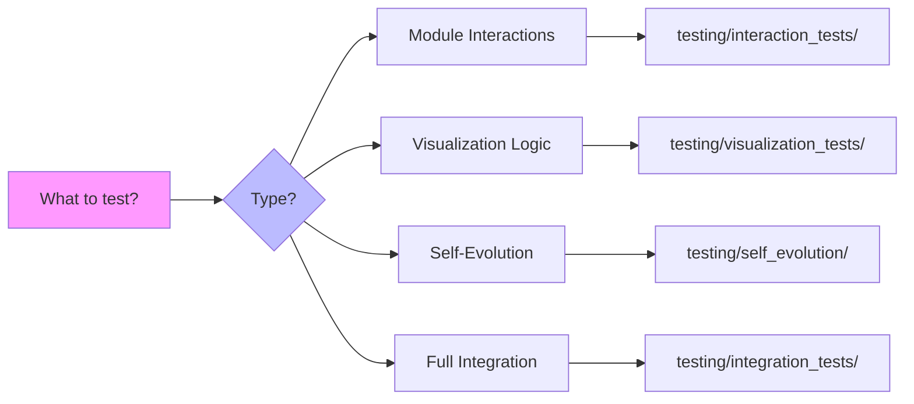
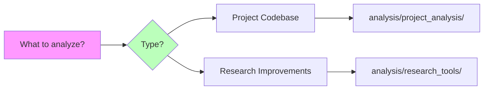
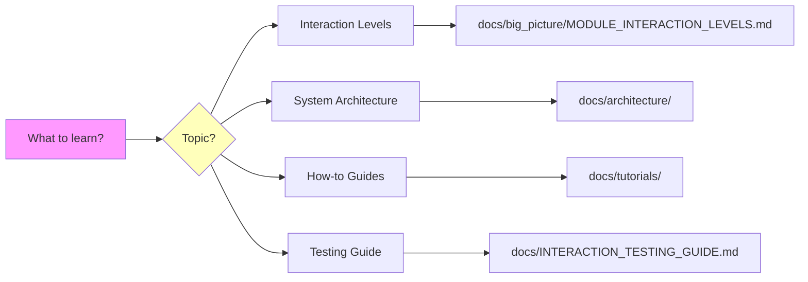
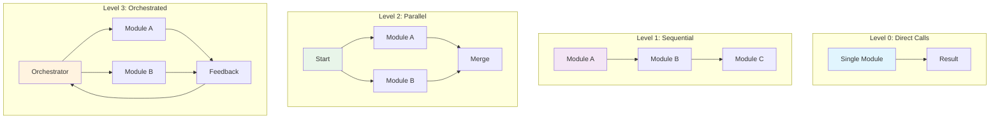
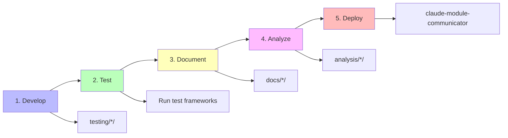
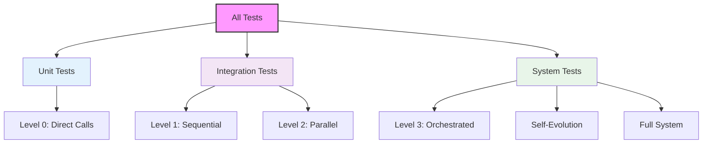

# 🗺️ Visual Project Map

A visual guide to navigating the shared_claude_docs project.

## 🏗️ Project Structure Overview

```mermaid
graph TD
    A[shared_claude_docs] --> B[testing/]
    A --> C[analysis/]
    A --> D[docs/]
    A --> E[utils/]
    A --> F[guides/]
    
    B --> B1[interaction_tests/]
    B --> B2[visualization_tests/]
    B --> B3[self_evolution/]
    B --> B4[integration_tests/]
    
    C --> C1[project_analysis/]
    C --> C2[research_tools/]
    
    D --> D1[big_picture/]
    D --> D2[architecture/]
    D --> D3[tutorials/]
    
    B1 --> B1a[interaction_test_framework.py]
    B1 --> B1b[interaction_runner.py]
    B1 --> B1c[stress_test_interactions.py]
    
    B2 --> B2a[visualization_decision_tests.py]
    B2 --> B2b[arangodb_visualization_interactions.py]
    
    B3 --> B3a[self_evolving_analyzer.py]
    B3 --> B3b[demo_self_evolution.py]
    
    C1 --> C1a[big_picture_analyzer.py]
    C1 --> C1b[enhanced_big_picture_analyzer.py]
    
    C2 --> C2a[research_driven_improvements.py]
    
    style A fill:#f9f,stroke:#333,stroke-width:4px
    style B fill:#bbf,stroke:#333,stroke-width:2px
    style C fill:#bfb,stroke:#333,stroke-width:2px
    style D fill:#ffb,stroke:#333,stroke-width:2px
```

## 🎯 Purpose-Based Navigation

### "I want to TEST something"

### "I want to ANALYZE something"

### "I want to LEARN something"

## 📊 Interaction Level Testing Flow

## 🔄 Development Workflow

## 📈 Testing Hierarchy

## 🎨 Color Legend

- 🟦 **Blue**: Testing-related
- 🟩 **Green**: Analysis tools
- 🟨 **Yellow**: Documentation
- 🟪 **Purple**: Main directories
- 🟧 **Orange**: Workflows

---

*This visual map helps you quickly navigate to the right part of the project based on your needs.*