# Memvid Visual Integration Map

*Document Created: 2025-01-08*
*Type: Visual Architecture Documentation*

## Overview

This document provides visual representations of how memvid integrates into the GRANGER ecosystem, showing data flows, storage decisions, and retrieval patterns.

## 1. High-Level Integration Architecture

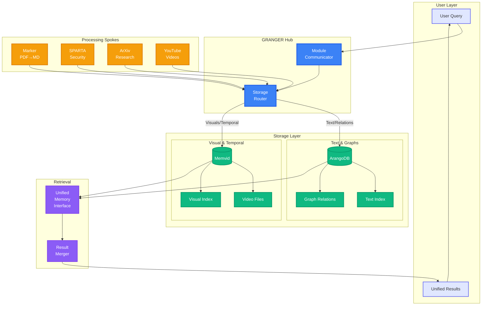

## 2. Storage Decision Flow

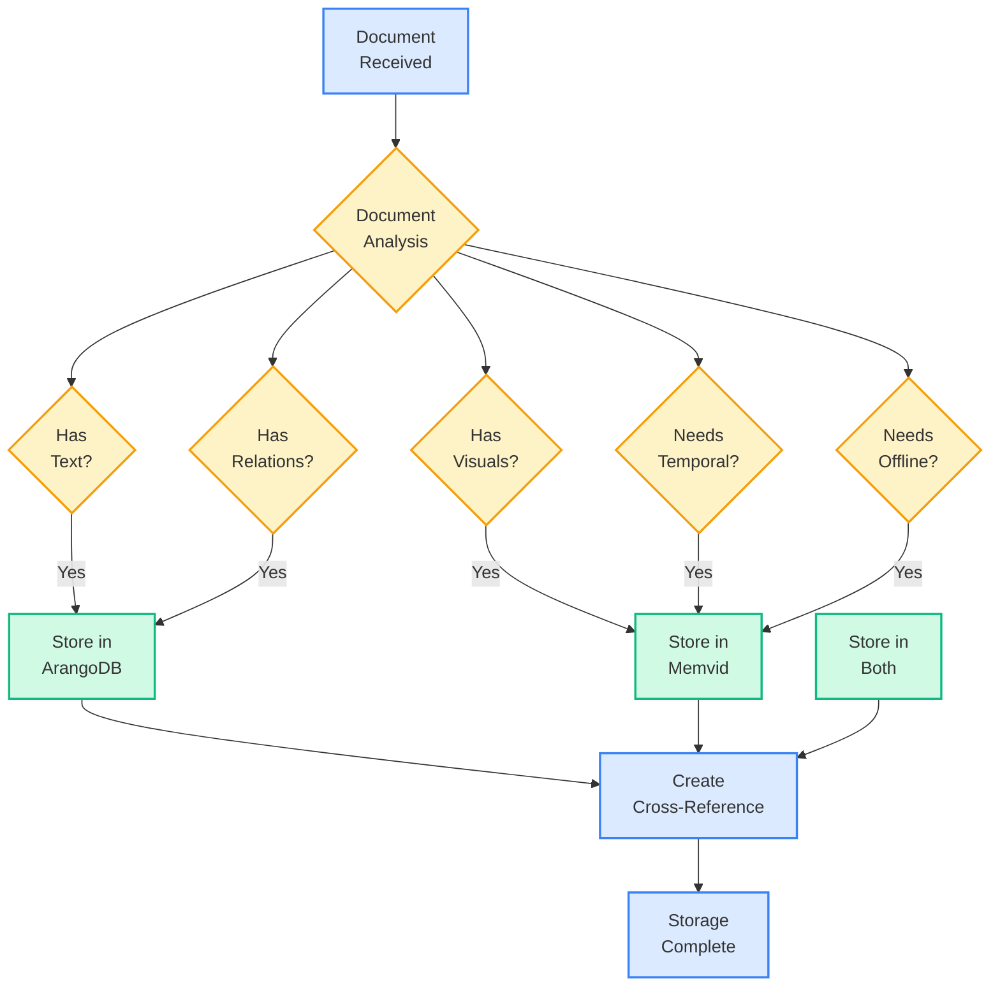

## 3. Data Flow Examples

### 3.1 Hardware Security Analysis Flow

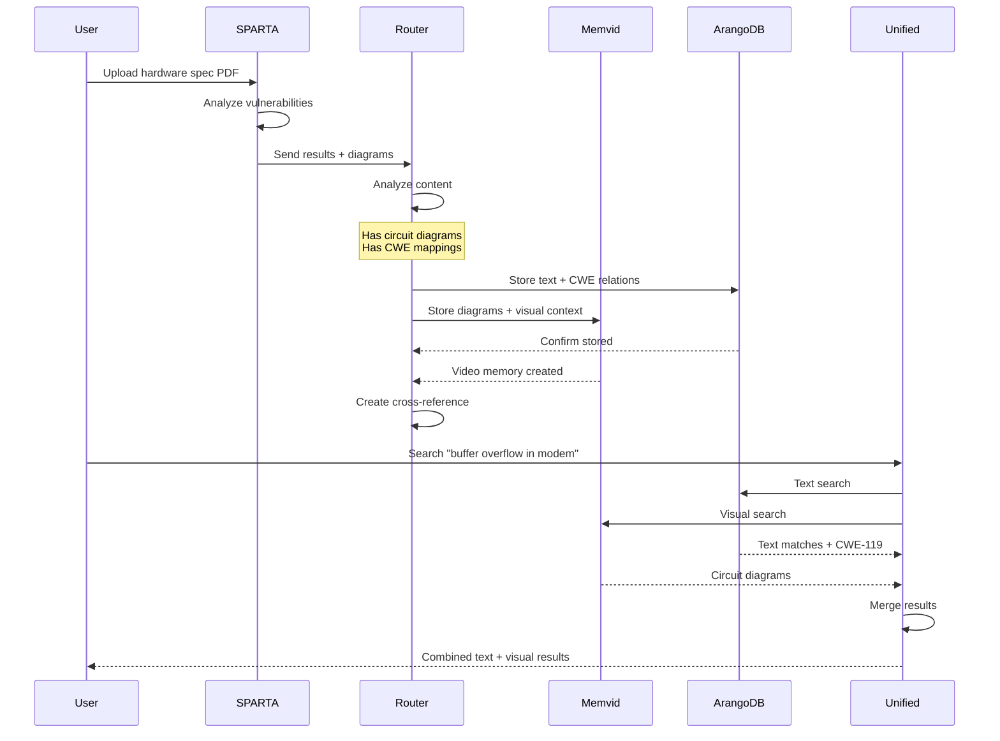

### 3.2 Research Paper Evolution Flow

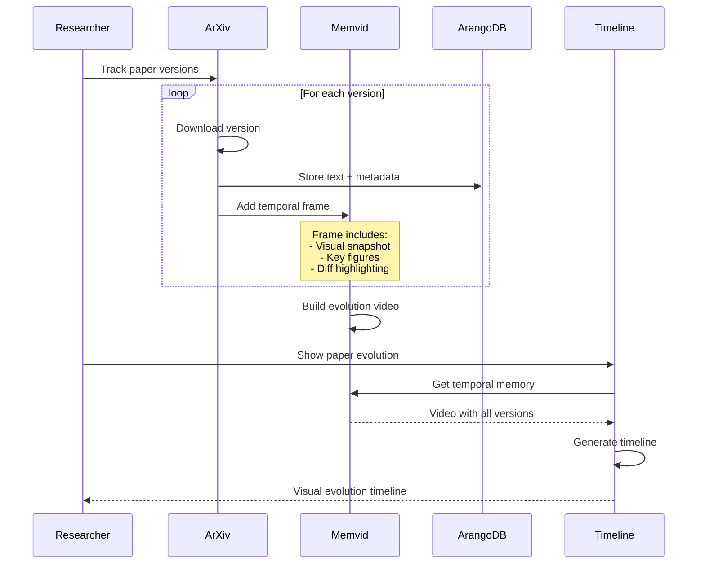

## 4. Unified Retrieval Architecture

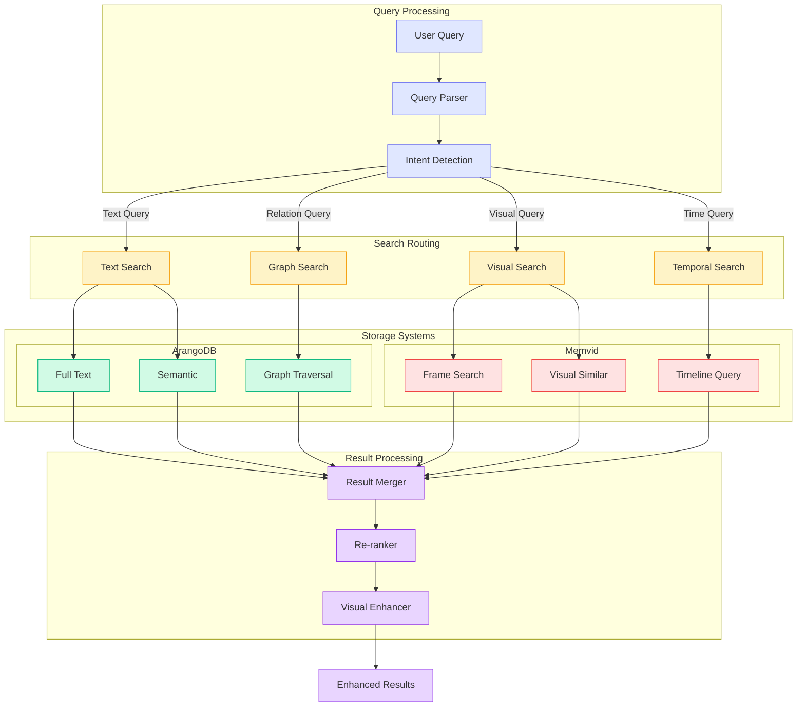

## 5. Module Communication Patterns

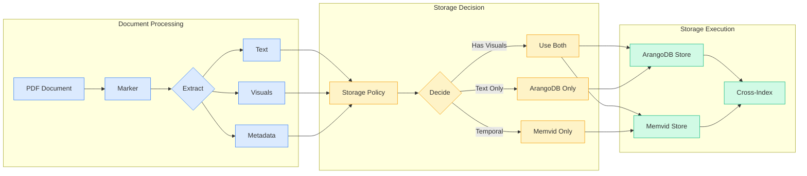

## 6. Performance Optimization Flow

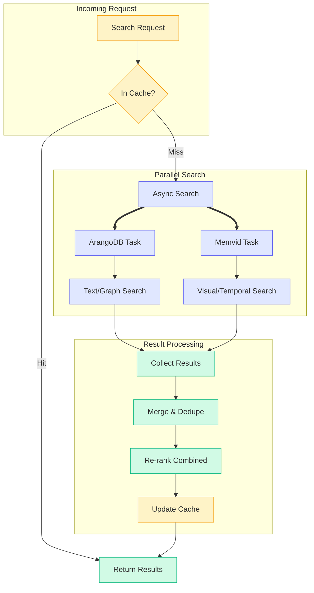

## 7. Use Case Specific Flows

### 7.1 Compliance Archive Creation

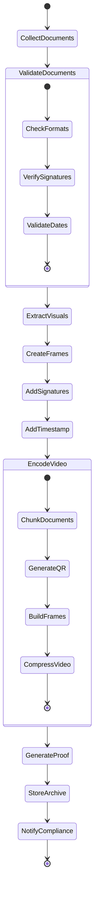

### 7.2 Visual Search Flow

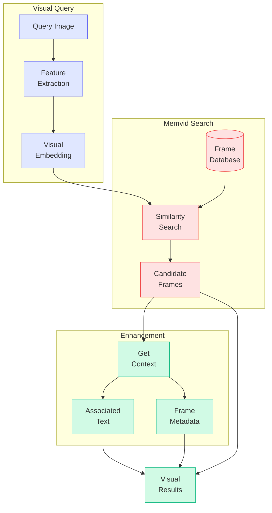

## 8. Monitoring Dashboard Layout

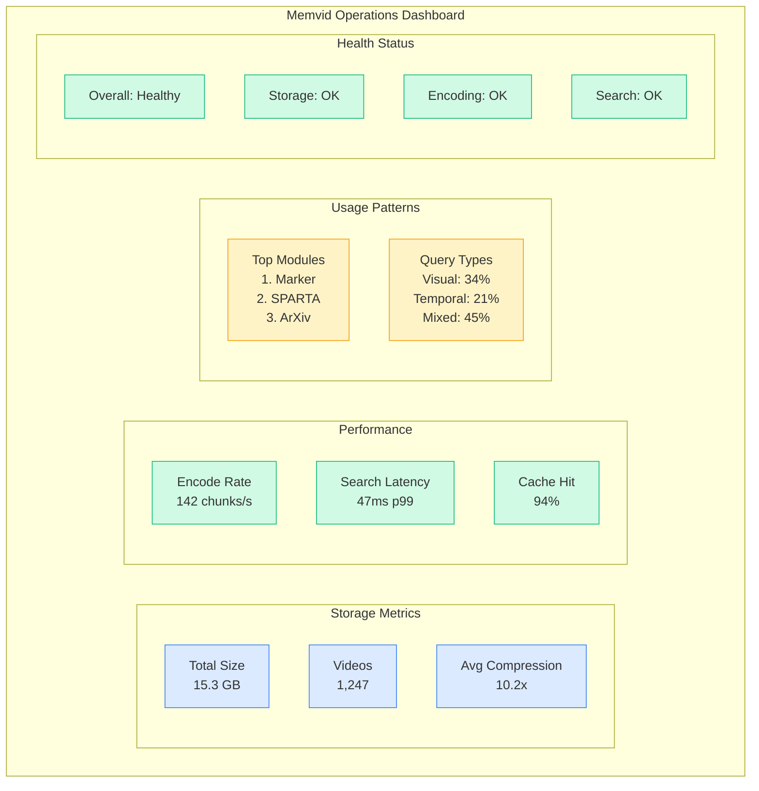

## 9. Integration Success Metrics

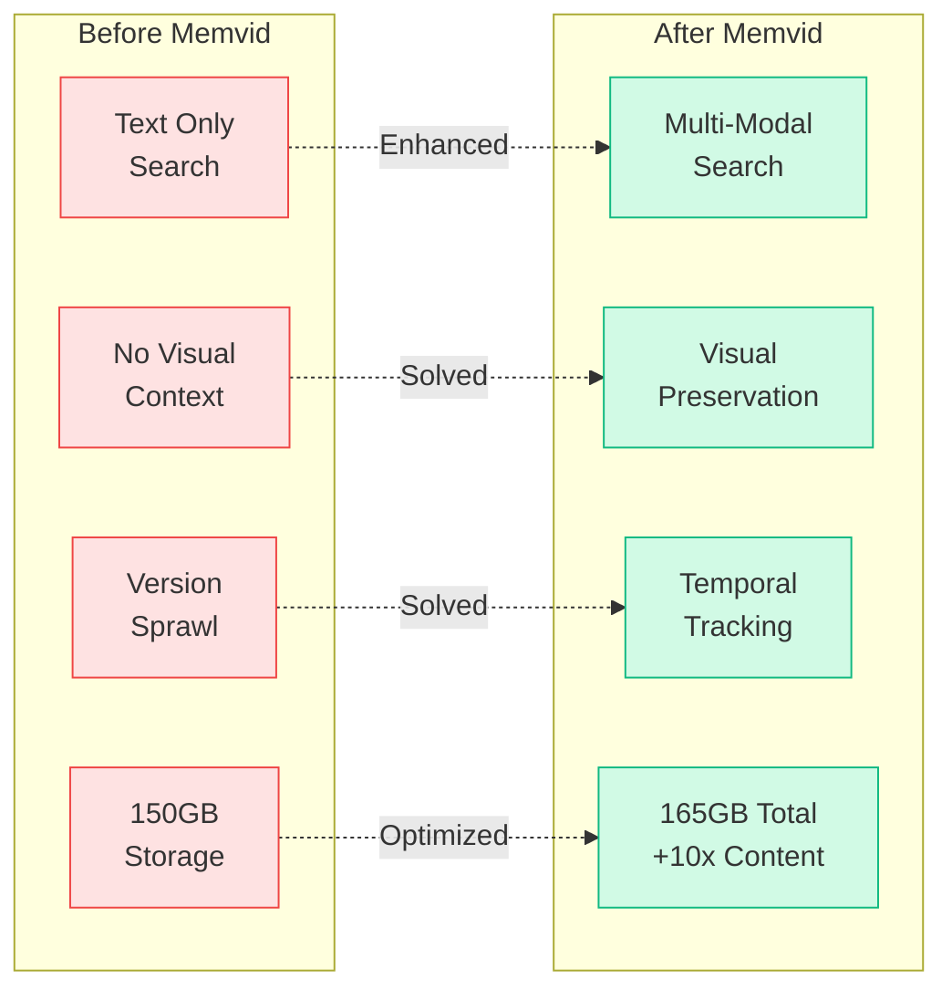

## 10. Future Architecture Evolution

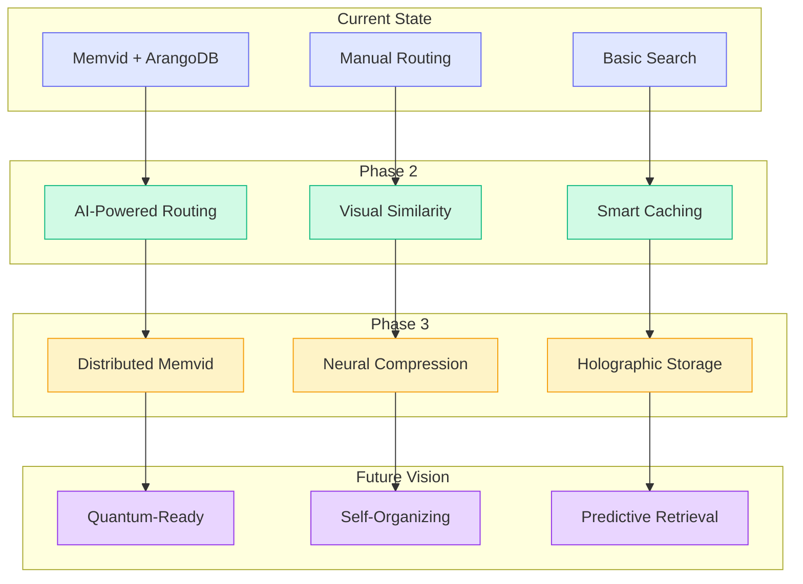

---

*These visual representations demonstrate how memvid seamlessly integrates into the GRANGER ecosystem, enhancing capabilities while maintaining architectural clarity. The diagrams serve as both documentation and decision-making tools for teams implementing and operating the integrated system.*