# GRANGER Complete Architecture - Modern Hub-Spoke Design

## 🌟 Complete Ecosystem Overview

```mermaid
graph TB
    %% Central Intelligence Core
    subgraph CoreIntelligence["Core Intelligence"]
        Hub["Granger Hub<br/><br/>🧠<br/><br/>Orchestration & Communication<br/>Schema • Progress • Coordination"]
        RL["RL Commons<br/><br/>🤖<br/><br/>Reinforcement Learning<br/>Bandits • DQN • Multi-Agent"]
        WorldModel["World Model<br/><br/>🌍<br/><br/>Self-Understanding<br/>Causal • Predictive • Learning"]
        TestReporter["Test Reporter<br/><br/>📊<br/><br/>Quality Assurance<br/>Reports • Flaky Tests • Metrics"]
    end
    
    %% User Interface Layer
    subgraph UILayer["User Interfaces"]
        User((("👤<br/>User")))
        Chat["Chat<br/><br/>💬<br/><br/>Conversational Interface<br/>React • FastAPI • MCP"]
        Annotator["Annotator<br/><br/>📝<br/><br/>Training Data UI<br/>PDF • Active Learning"]
        Terminal["Aider Daemon<br/><br/>🖥️<br/><br/>Terminal Interface<br/>CLI • AI Coding"]
    end
    
    %% Infrastructure Services
    subgraph Infrastructure["Infrastructure"]
        RunPod["RunPod Ops<br/><br/>⚡<br/><br/>GPU Compute<br/>RTX 4090 → H100"]
        SharedUI["Granger UI<br/><br/>🎨<br/><br/>Design System<br/>Tokens • Components"]
        SharedDocs["Shared Docs<br/><br/>📚<br/><br/>Documentation<br/>Patterns • Standards"]
    end
    
    %% Data Collection Spokes
    subgraph DataCollection["Data Collection"]
        ArXiv["ArXiv MCP<br/><br/>📄<br/><br/>Research Papers<br/>45+ Tools • Evidence"]
        YouTube["YouTube<br/><br/>🎥<br/><br/>Video Transcripts<br/>Rate Limit • Cache"]
        DARPA["DARPA Crawl<br/><br/>🌐<br/><br/>Funding Intel<br/>I2O • Proposals"]
        GitGet["GitGet<br/><br/>📦<br/><br/>Code Analysis<br/>Clone • Parse • Docs"]
    end
    
    %% Document Processing
    subgraph DocProcessing["Document Processing"]
        SPARTA["SPARTA<br/><br/>🛡️<br/><br/>Security Analysis<br/>NIST • Vulnerabilities"]
        Marker["Marker<br/><br/>🔍<br/><br/>PDF Extraction<br/>Tables • Images • AI"]
        Screenshot["Screenshot<br/><br/>📸<br/><br/>Visual Analysis<br/>Capture • AI • Search"]
    end
    
    %% Knowledge & AI Layer
    subgraph KnowledgeAI["Knowledge & AI"]
        ArangoDB["ArangoDB<br/><br/>🗄️<br/><br/>Graph Database<br/>Memory • Search"]
        LLMCall["LLM Call<br/><br/>🚀<br/><br/>Multi-LLM Gateway<br/>Claude • Ollama • GPT"]
        Unsloth["Unsloth<br/><br/>🦥<br/><br/>Fine-tuning<br/>LoRA • DAPO • Deploy"]
    end
    
    %% User Connections
    User o--o|"interact"| Chat
    User o--o|"annotate"| Annotator
    User o--o|"code"| Terminal
    
    %% UI to Hub
    Chat o===o Hub
    Annotator o===o Hub
    Terminal o===o Hub
    
    %% Hub to Core Intelligence
    Hub o===o RL
    Hub o===o WorldModel
    Hub o===o TestReporter
    
    %% Hub to Infrastructure
    Hub o===o RunPod
    Hub o===o SharedUI
    Hub o===o SharedDocs
    
    %% Hub to Data Collection
    Hub o===o ArXiv
    Hub o===o YouTube
    Hub o===o DARPA
    Hub o===o GitGet
    
    %% Hub to Processing
    Hub o===o SPARTA
    Hub o===o Marker
    Hub o===o Screenshot
    
    %% Hub to Knowledge/AI
    Hub o===o ArangoDB
    Hub o===o LLMCall
    Hub o===o Unsloth
    
    %% Cross-module connections
    ArXiv o--o Marker
    Marker o--o SPARTA
    SPARTA o--o ArangoDB
    ArangoDB o--o Unsloth
    Unsloth o--o LLMCall
    LLMCall o--o RL
    RunPod o--o Unsloth
    RunPod o--o LLMCall
    
    %% Styling with modern colors from image
    classDef hubStyle fill:#2563EB,stroke:#1E40AF,stroke-width:2px,color:#FFFFFF,rx:10,ry:10
    classDef uiStyle fill:#0891B2,stroke:#0E7490,stroke-width:2px,color:#FFFFFF,rx:10,ry:10
    classDef dataStyle fill:#059669,stroke:#047857,stroke-width:2px,color:#FFFFFF,rx:10,ry:10
    classDef processStyle fill:#D97706,stroke:#B45309,stroke-width:2px,color:#FFFFFF,rx:10,ry:10
    classDef aiStyle fill:#DC2626,stroke:#B91C1C,stroke-width:2px,color:#FFFFFF,rx:10,ry:10
    classDef infraStyle fill:#4B5563,stroke:#374151,stroke-width:2px,color:#FFFFFF,rx:10,ry:10
    classDef userStyle fill:#1F2937,stroke:#111827,stroke-width:3px,color:#FFFFFF
    
    class Hub,RL,WorldModel,TestReporter hubStyle
    class Chat,Annotator,Terminal uiStyle
    class ArXiv,YouTube,DARPA,GitGet dataStyle
    class SPARTA,Marker,Screenshot processStyle
    class ArangoDB,LLMCall,Unsloth aiStyle
    class RunPod,SharedUI,SharedDocs infraStyle
    class User userStyle
    
    %% Subgraph styling to match image
    style CoreIntelligence fill:#1E3A8A,stroke:#1E40AF,stroke-width:3px,rx:15,ry:15,color:#FFFFFF
    style UILayer fill:#065F46,stroke:#047857,stroke-width:3px,rx:15,ry:15,color:#FFFFFF
    style Infrastructure fill:#374151,stroke:#1F2937,stroke-width:3px,rx:15,ry:15,color:#FFFFFF
    style DataCollection fill:#713F12,stroke:#78350F,stroke-width:3px,rx:15,ry:15,color:#FFFFFF
    style DocProcessing fill:#7C2D12,stroke:#78350F,stroke-width:3px,rx:15,ry:15,color:#FFFFFF
    style KnowledgeAI fill:#991B1B,stroke:#7F1D1D,stroke-width:3px,rx:15,ry:15,color:#FFFFFF
```

## 🔄 Interaction Levels Visualization

```mermaid
graph TB
    subgraph Level0["Level 0: Individual Modules"]
        L0A["📄 ArXiv.search()"]
        L0B["🔍 Marker.extract()"]
        L0C["🗄️ ArangoDB.store()"]
    end
    
    subgraph Level1["Level 1: Sequential Chains"]
        L1Start["📥 Input"] --> L1A["📄 ArXiv"]
        L1A --> L1B["🔍 Marker"]
        L1B --> L1C["🛡️ SPARTA"]
        L1C --> L1End["📤 Output"]
    end
    
    subgraph Level2["Level 2: Parallel & Branching"]
        L2Hub["🧠 Hub"]
        L2A["📄 ArXiv"]
        L2B["🎥 YouTube"]
        L2C["🌐 DARPA"]
        L2Merge["🔄 Merge"]
        
        L2Hub --> L2A
        L2Hub --> L2B
        L2Hub --> L2C
        L2A --> L2Merge
        L2B --> L2Merge
        L2C --> L2Merge
    end
    
    subgraph Level3["Level 3: Orchestrated Intelligence"]
        L3Hub["🧠 Hub"]
        L3RL["🤖 RL"]
        L3World["🌍 World Model"]
        L3Modules["📦 All Modules"]
        
        L3Hub <--> L3RL
        L3Hub <--> L3World
        L3RL <--> L3World
        L3Hub <--> L3Modules
        L3RL --> L3Hub
    end
    
    subgraph Level4["Level 4: Human-in-the-Loop"]
        L4User["👤 Human"]
        L4UI["💬 UI"]
        L4Hub["🧠 Hub"]
        L4Adapt["🎯 Adaptive UI"]
        
        L4User <--> L4UI
        L4UI <--> L4Hub
        L4Hub --> L4Adapt
        L4Adapt --> L4UI
    end
    
    style Level0 fill:#F3F4F6,stroke:#9CA3AF,stroke-width:2px,rx:10,ry:10
    style Level1 fill:#DBEAFE,stroke:#3B82F6,stroke-width:2px,rx:10,ry:10
    style Level2 fill:#DDD6FE,stroke:#8B5CF6,stroke-width:2px,rx:10,ry:10
    style Level3 fill:#CFFAFE,stroke:#06B6D4,stroke-width:2px,rx:10,ry:10
    style Level4 fill:#D1FAE5,stroke:#10B981,stroke-width:2px,rx:10,ry:10
```

## 📊 Module Category Distribution

## 🚀 Key Pipeline Flows

### Research Pipeline

```mermaid
graph LR
    subgraph Input
        Query["🔍 Research Query"]
    end
    
    subgraph Discovery
        ArXiv1["📄 ArXiv<br/>Papers"]
        YouTube1["🎥 YouTube<br/>Videos"]
        DARPA1["🌐 DARPA<br/>Funding"]
    end
    
    subgraph Processing
        Marker1["🔍 Extract<br/>Content"]
        SPARTA1["🛡️ Analyze<br/>Security"]
    end
    
    subgraph Knowledge
        ArangoDB1["🗄️ Build<br/>Graph"]
        Unsloth1["🦥 Train<br/>Model"]
    end
    
    subgraph Output
        Result["📊 Research<br/>Insights"]
    end
    
    Query --> ArXiv1
    Query --> YouTube1
    Query --> DARPA1
    
    ArXiv1 --> Marker1
    YouTube1 --> Marker1
    DARPA1 --> SPARTA1
    
    Marker1 --> ArangoDB1
    SPARTA1 --> ArangoDB1
    
    ArangoDB1 --> Unsloth1
    Unsloth1 --> Result
    
    style Discovery fill:#F0FDF4,stroke:#10B981
    style Processing fill:#FFFBEB,stroke:#F59E0B
    style Knowledge fill:#FEF2F2,stroke:#EF4444
```

## 🎨 Design System Colors

| Component Type | Primary Color | Secondary Color | Use Case |
|----------------|---------------|-----------------|----------|
| **Core Intelligence** | #3B82F6 (Blue) | #1E40AF | Hub, RL, World Model |
| **User Interfaces** | #06B6D4 (Cyan) | #0891B2 | Chat, Annotator, Terminal |
| **Data Collection** | #10B981 (Green) | #059669 | ArXiv, YouTube, DARPA |
| **Processing** | #F59E0B (Amber) | #D97706 | SPARTA, Marker, Screenshot |
| **Knowledge/AI** | #EF4444 (Red) | #DC2626 | ArangoDB, LLM, Unsloth |
| **Infrastructure** | #6B7280 (Gray) | #4B5563 | RunPod, Shared Resources |

## 📈 Scalability Features

1. **Modular Architecture**: Add/remove spokes without core changes
2. **GPU Orchestration**: Dynamic compute allocation via RunPod
3. **Multi-LLM Support**: Seamless model switching and routing
4. **Distributed Learning**: RL optimization across all modules
5. **Self-Improvement**: World Model enables autonomous evolution

---

*This diagram represents the complete GRANGER ecosystem with all 20 active modules, showing the sophisticated interplay between data collection, processing, intelligence, and human interaction layers.*