# GRANGER Architecture Diagram

## 🚀 Hub and Spoke Architecture

```mermaid
graph TB
    %% Central Hub
    Hub["<b>GRANGER HUB</b><br/><br/><span style='font-size:48px'>🧠</span><br/><br/><span style='font-size:12px; opacity:0.8'>Orchestration</span>"]
    
    %% User
    User((("<span style='font-size:32px'>👤</span><br/><b style='font-size:14px'>User</b>")))
    
    %% User Interfaces
    Chat["<b>Chat</b><br/><br/><span style='font-size:40px'>💬</span><br/><br/><span style='font-size:11px; opacity:0.7'>Conversational</span>"]
    Annotator["<b>Annotator</b><br/><br/><span style='font-size:40px'>✏️</span><br/><br/><span style='font-size:11px; opacity:0.7'>Training Data</span>"]
    Terminal["<b>Terminal</b><br/><br/><span style='font-size:40px'>⌨️</span><br/><br/><span style='font-size:11px; opacity:0.7'>AI Coding</span>"]
    
    %% Core Intelligence
    RL["<b>RL Commons</b><br/><br/><span style='font-size:40px'>🎯</span><br/><br/><span style='font-size:11px; opacity:0.7'>Learning</span>"]
    WorldModel["<b>World Model</b><br/><br/><span style='font-size:40px'>🌍</span><br/><br/><span style='font-size:11px; opacity:0.7'>Prediction</span>"]
    TestReporter["<b>Test Reporter</b><br/><br/><span style='font-size:40px'>📊</span><br/><br/><span style='font-size:11px; opacity:0.7'>Quality</span>"]
    
    %% Data Collection
    ArXiv["<b>ArXiv</b><br/><br/><span style='font-size:40px'>📚</span><br/><br/><span style='font-size:11px; opacity:0.7'>Research</span>"]
    YouTube["<b>YouTube</b><br/><br/><span style='font-size:40px'>🎥</span><br/><br/><span style='font-size:11px; opacity:0.7'>Transcripts</span>"]
    DARPA["<b>DARPA</b><br/><br/><span style='font-size:40px'>🏛️</span><br/><br/><span style='font-size:11px; opacity:0.7'>Funding</span>"]
    GitGet["<b>GitGet</b><br/><br/><span style='font-size:40px'>📦</span><br/><br/><span style='font-size:11px; opacity:0.7'>Code</span>"]
    
    %% Processing
    SPARTA["<b>SPARTA</b><br/><br/><span style='font-size:40px'>🛡️</span><br/><br/><span style='font-size:11px; opacity:0.7'>Security</span>"]
    Marker["<b>Marker</b><br/><br/><span style='font-size:40px'>🔍</span><br/><br/><span style='font-size:11px; opacity:0.7'>Extract</span>"]
    Screenshot["<b>Screenshot</b><br/><br/><span style='font-size:40px'>📸</span><br/><br/><span style='font-size:11px; opacity:0.7'>Visual</span>"]
    
    %% Storage & AI
    ArangoDB["<b>ArangoDB</b><br/><br/><span style='font-size:40px'>🕸️</span><br/><br/><span style='font-size:11px; opacity:0.7'>Graph DB</span>"]
    LLMCall["<b>LLM Call</b><br/><br/><span style='font-size:40px'>🤖</span><br/><br/><span style='font-size:11px; opacity:0.7'>Multi-LLM</span>"]
    Unsloth["<b>Unsloth</b><br/><br/><span style='font-size:40px'>🦥</span><br/><br/><span style='font-size:11px; opacity:0.7'>Fine-tune</span>"]
    
    %% User connections
    User -.-> Chat
    User -.-> Annotator
    User -.-> Terminal
    
    %% UI to Hub
    Chat --> Hub
    Annotator --> Hub
    Terminal --> Hub
    
    %% Hub to all spokes (radial pattern)
    Hub ==> RL
    Hub ==> WorldModel
    Hub ==> TestReporter
    Hub ==> ArXiv
    Hub ==> YouTube
    Hub ==> DARPA
    Hub ==> GitGet
    Hub ==> SPARTA
    Hub ==> Marker
    Hub ==> Screenshot
    Hub ==> ArangoDB
    Hub ==> LLMCall
    Hub ==> Unsloth
    
    %% Styling
    classDef hubStyle fill:#3B82F6,stroke:#2563EB,stroke-width:3px,color:#FFFFFF,rx:10,ry:10
    classDef uiStyle fill:#06B6D4,stroke:#0891B2,stroke-width:2px,color:#FFFFFF,rx:10,ry:10
    classDef coreStyle fill:#8B5CF6,stroke:#7C3AED,stroke-width:2px,color:#FFFFFF,rx:10,ry:10
    classDef dataStyle fill:#10B981,stroke:#059669,stroke-width:2px,color:#FFFFFF,rx:10,ry:10
    classDef processStyle fill:#F59E0B,stroke:#D97706,stroke-width:2px,color:#FFFFFF,rx:10,ry:10
    classDef aiStyle fill:#EF4444,stroke:#DC2626,stroke-width:2px,color:#FFFFFF,rx:10,ry:10
    classDef userStyle fill:#1F2937,stroke:#111827,stroke-width:3px,color:#FFFFFF
    
    class Hub hubStyle
    class Chat,Annotator,Terminal uiStyle
    class RL,WorldModel,TestReporter coreStyle
    class ArXiv,YouTube,DARPA,GitGet dataStyle
    class SPARTA,Marker,Screenshot processStyle
    class ArangoDB,LLMCall,Unsloth aiStyle
    class User userStyle
```

## 🔄 Key Interactions - Showcasing Flexibility

### 1️⃣ Research Paper Analysis Flow
```mermaid
graph LR
    User1["👤<br/>Researcher"] o--o Chat1["💬<br/>Chat"]
    Chat1 o===o Hub1["🧠<br/>Hub"]
    Hub1 o===o ArXiv1["📄<br/>ArXiv<br/><small>quantum computing</small>"]
    ArXiv1 o--o Marker1["🔍<br/>Marker<br/><small>Extract text</small>"]
    Marker1 o--o ArangoDB1["🗄️<br/>ArangoDB<br/><small>Store knowledge</small>"]
    ArangoDB1 o--o RL1["🤖<br/>RL<br/><small>Learn preferences</small>"]
    
    style User1 fill:#6366F1,stroke:#4F46E5,color:#FFF,rx:10,ry:10
    style Hub1 fill:#FEF3C7,stroke:#F59E0B,color:#1F2937,rx:10,ry:10
    style Chat1 fill:#1F2937,stroke:#111827,color:#FFF,rx:10,ry:10
    style ArXiv1 fill:#D1FAE5,stroke:#10B981,color:#1F2937,rx:10,ry:10
    style Marker1 fill:#DBEAFE,stroke:#3B82F6,color:#1F2937,rx:10,ry:10
    style ArangoDB1 fill:#D1FAE5,stroke:#10B981,color:#1F2937,rx:10,ry:10
    style RL1 fill:#FEF3C7,stroke:#F59E0B,color:#1F2937,rx:10,ry:10
```

### 2️⃣ Security Analysis Pipeline
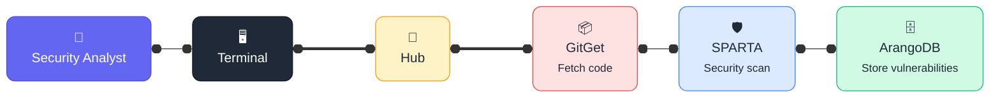

### 3️⃣ Multi-Source Learning
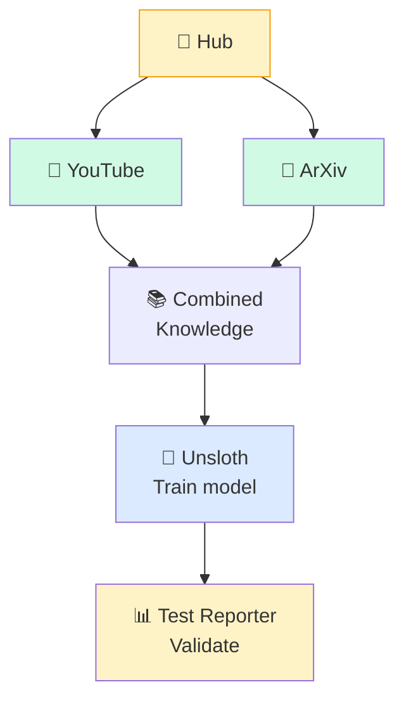

### 4️⃣ Document Annotation Workflow
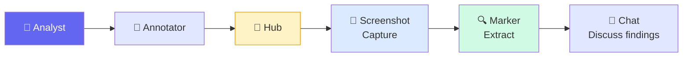

### 5️⃣ Adaptive Optimization Loop
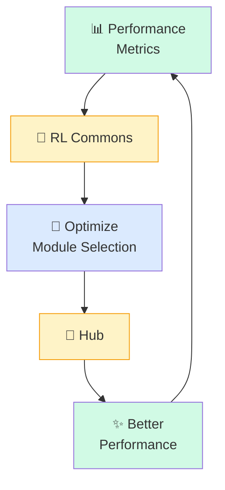

### 6️⃣ Web Research Integration
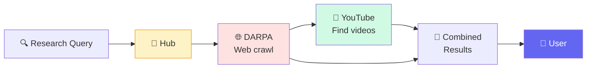

## 📊 Architecture Benefits

| Feature | Description |
|---------|-------------|
| **🔄 Flexibility** | Add/remove spokes without affecting core |
| **🧠 Intelligence** | RL continuously optimizes workflows |
| **🎯 Orchestration** | Hub manages all complexity |
| **📈 Scalability** | New modules plug in easily |
| **🔗 Interoperability** | Spokes can work together via hub |

## 🎯 High-Value Client Interactions

### 7️⃣ Defense Contract Compliance Analysis
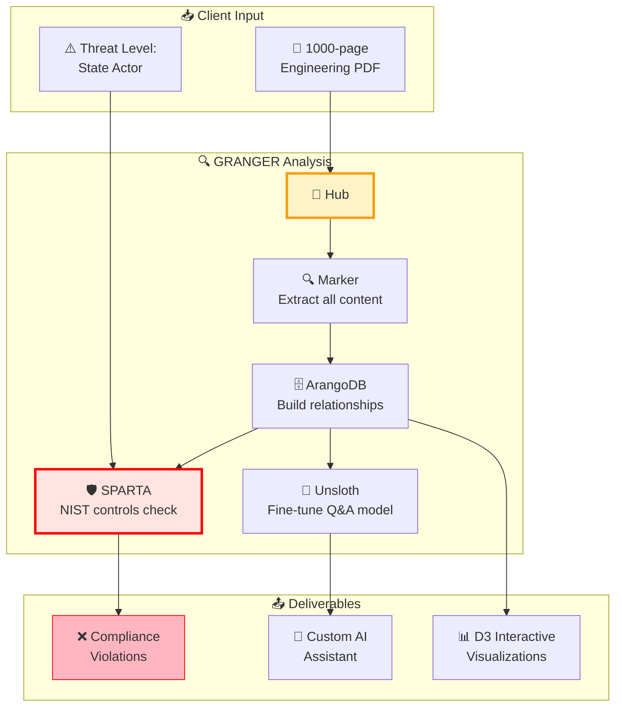

### 8️⃣ Requirements vs Codebase Divergence Check
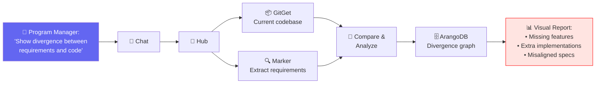

### 9️⃣ Contract Compliance Verification
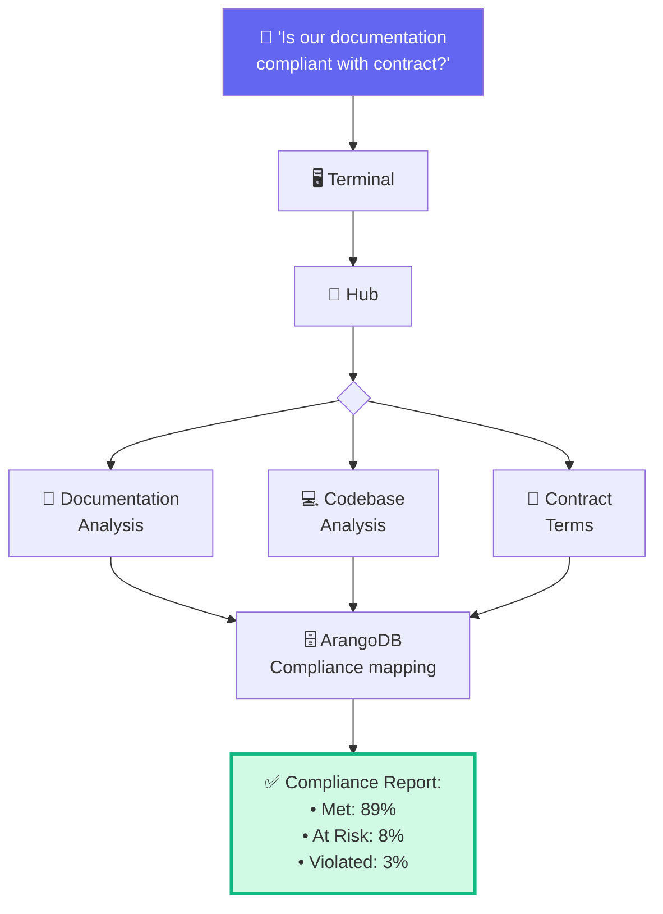

### 🔟 Dynamic Threat Mapping
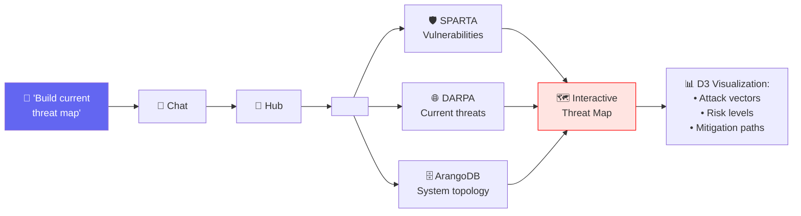

### 1️⃣1️⃣ Deep Technical Q&A with Context
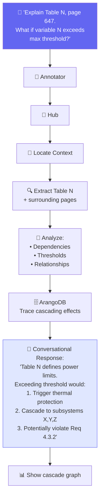

### 1️⃣2️⃣ DARPA Opportunity Discovery & Codebase Evolution
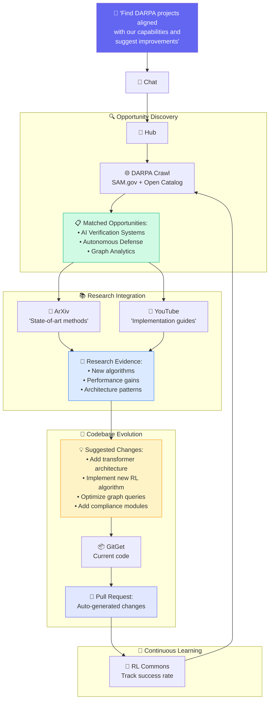

## 💡 Key Differentiators for Defense/Engineering Clients

| Capability | GRANGER Advantage |
|------------|-------------------|
| **📑 Large Document Handling** | Process 1000+ page PDFs with full context retention |
| **🔗 Relationship Mapping** | ArangoDB builds complex dependency graphs automatically |
| **🛡️ Compliance Checking** | SPARTA integration for NIST/security control validation |
| **🤖 Custom AI Models** | Unsloth creates domain-specific assistants |
| **📊 Interactive Visualizations** | D3.js graphs for complex data relationships |
| **💬 Conversational Depth** | Maintains context across technical discussions |
| **🔄 Real-time Analysis** | Live updates as requirements or code changes |

## 🎨 Color Legend

- 🟨 **Yellow/Orange**: Hub components (Intelligence layer)
- 🟦 **Blue/Purple**: User interfaces
- 🟩 **Green**: Data sources / Success states
- 🟦 **Light Blue**: Processing modules
- 🟥 **Red/Pink**: Security/Risk/Compliance elements
- ⬜ **White/Gray**: Neutral information flow

---

*GRANGER's flexible architecture enables deep technical analysis, compliance verification, and intelligent Q&A for mission-critical engineering projects while maintaining conversational context throughout complex workflows.*