# GRANGER Architecture Diagram

## 🚀 Hub and Spoke Architecture

```mermaid
graph TB
    %% Central Intelligence Core
    subgraph CoreIntelligence["Core Intelligence"]
        Hub["Granger Hub<br/><br/>🧠<br/><br/>Orchestration & Communication<br/>Schema • Progress • Coordination"]
        RL["RL Commons<br/><br/>🤖<br/><br/>Reinforcement Learning<br/>Bandits • DQN • Multi-Agent"]
        WorldModel["World Model<br/><br/>🌍<br/><br/>Self-Understanding<br/>Causal • Predictive • Learning"]
        TestReporter["Test Reporter<br/><br/>📊<br/><br/>Quality Assurance<br/>Reports • Flaky Tests • Metrics"]
    end
    
    %% User Interface Layer
    subgraph UILayer["User Interfaces"]
        User((("👤<br/>User")))
        Chat["Chat<br/><br/>💬<br/><br/>Conversational Interface<br/>React • FastAPI • MCP"]
        Annotator["Annotator<br/><br/>📝<br/><br/>Training Data UI<br/>PDF • Active Learning"]
        Terminal["Aider Daemon<br/><br/>🖥️<br/><br/>Terminal Interface<br/>CLI • AI Coding"]
    end
    
    %% Infrastructure Services
    subgraph Infrastructure["Infrastructure"]
        RunPod["RunPod Ops<br/><br/>⚡<br/><br/>GPU Compute<br/>RTX 4090 → H100"]
        SharedUI["Granger UI<br/><br/>🎨<br/><br/>Design System<br/>Tokens • Components"]
        SharedDocs["Shared Docs<br/><br/>📚<br/><br/>Documentation<br/>Patterns • Standards"]
    end
    
    %% Data Collection Spokes
    subgraph DataCollection["Data Collection"]
        ArXiv["ArXiv MCP<br/><br/>📄<br/><br/>Research Papers<br/>45+ Tools • Evidence"]
        YouTube["YouTube<br/><br/>🎥<br/><br/>Video Transcripts<br/>Rate Limit • Cache"]
        DARPA["DARPA Crawl<br/><br/>🌐<br/><br/>Funding Intel<br/>I2O • Proposals"]
        GitGet["GitGet<br/><br/>📦<br/><br/>Code Analysis<br/>Clone • Parse • Docs"]
    end
    
    %% Document Processing
    subgraph DocProcessing["Document Processing"]
        SPARTA["SPARTA<br/><br/>🛡️<br/><br/>Security Analysis<br/>NIST • Vulnerabilities"]
        Marker["Marker<br/><br/>🔍<br/><br/>PDF Extraction<br/>Tables • Images • AI"]
        Screenshot["Screenshot<br/><br/>📸<br/><br/>Visual Analysis<br/>Capture • AI • Search"]
    end
    
    %% Knowledge & AI Layer
    subgraph KnowledgeAI["Knowledge & AI"]
        ArangoDB["ArangoDB<br/><br/>🗄️<br/><br/>Graph Database<br/>Memory • Search"]
        LLMCall["LLM Call<br/><br/>🚀<br/><br/>Multi-LLM Gateway<br/>Claude • Ollama • GPT"]
        Unsloth["Unsloth<br/><br/>🦥<br/><br/>Fine-tuning<br/>LoRA • DAPO • Deploy"]
    end
    
    %% User Connections
    User o--o|"interact"| Chat
    User o--o|"annotate"| Annotator
    User o--o|"code"| Terminal
    
    %% UI to Hub
    Chat o===o Hub
    Annotator o===o Hub
    Terminal o===o Hub
    
    %% Hub to Core Intelligence
    Hub o===o RL
    Hub o===o WorldModel
    Hub o===o TestReporter
    
    %% Hub to Infrastructure
    Hub o===o RunPod
    Hub o===o SharedUI
    Hub o===o SharedDocs
    
    %% Hub to Data Collection
    Hub o===o ArXiv
    Hub o===o YouTube
    Hub o===o DARPA
    Hub o===o GitGet
    
    %% Hub to Processing
    Hub o===o SPARTA
    Hub o===o Marker
    Hub o===o Screenshot
    
    %% Hub to Knowledge/AI
    Hub o===o ArangoDB
    Hub o===o LLMCall
    Hub o===o Unsloth
    
    %% Cross-module connections
    ArXiv o--o Marker
    Marker o--o SPARTA
    SPARTA o--o ArangoDB
    ArangoDB o--o Unsloth
    Unsloth o--o LLMCall
    LLMCall o--o RL
    RunPod o--o Unsloth
    RunPod o--o LLMCall
    
    %% Styling with modern colors from image
    classDef hubStyle fill:#2563EB,stroke:#1E40AF,stroke-width:2px,color:#FFFFFF,rx:10,ry:10
    classDef uiStyle fill:#0891B2,stroke:#0E7490,stroke-width:2px,color:#FFFFFF,rx:10,ry:10
    classDef dataStyle fill:#059669,stroke:#047857,stroke-width:2px,color:#FFFFFF,rx:10,ry:10
    classDef processStyle fill:#D97706,stroke:#B45309,stroke-width:2px,color:#FFFFFF,rx:10,ry:10
    classDef aiStyle fill:#DC2626,stroke:#B91C1C,stroke-width:2px,color:#FFFFFF,rx:10,ry:10
    classDef infraStyle fill:#4B5563,stroke:#374151,stroke-width:2px,color:#FFFFFF,rx:10,ry:10
    classDef userStyle fill:#1F2937,stroke:#111827,stroke-width:3px,color:#FFFFFF
    
    class Hub,RL,WorldModel,TestReporter hubStyle
    class Chat,Annotator,Terminal uiStyle
    class ArXiv,YouTube,DARPA,GitGet dataStyle
    class SPARTA,Marker,Screenshot processStyle
    class ArangoDB,LLMCall,Unsloth aiStyle
    class RunPod,SharedUI,SharedDocs infraStyle
    class User userStyle
    
    %% Subgraph styling to match image
    style CoreIntelligence fill:#1E3A8A,stroke:#1E40AF,stroke-width:3px,rx:15,ry:15,color:#FFFFFF
    style UILayer fill:#065F46,stroke:#047857,stroke-width:3px,rx:15,ry:15,color:#FFFFFF
    style Infrastructure fill:#374151,stroke:#1F2937,stroke-width:3px,rx:15,ry:15,color:#FFFFFF
    style DataCollection fill:#713F12,stroke:#78350F,stroke-width:3px,rx:15,ry:15,color:#FFFFFF
    style DocProcessing fill:#7C2D12,stroke:#78350F,stroke-width:3px,rx:15,ry:15,color:#FFFFFF
    style KnowledgeAI fill:#991B1B,stroke:#7F1D1D,stroke-width:3px,rx:15,ry:15,color:#FFFFFF
```

## 🔄 Key Interactions - Showcasing Flexibility

### 1️⃣ Research Paper Analysis Flow
```mermaid
graph LR
    User1["👤<br/>Researcher"] o--o Chat1["💬<br/>Chat"]
    Chat1 o===o Hub1["🧠<br/>Hub"]
    Hub1 o===o ArXiv1["📄<br/>ArXiv<br/><small>quantum computing</small>"]
    ArXiv1 o--o Marker1["🔍<br/>Marker<br/><small>Extract text</small>"]
    Marker1 o--o ArangoDB1["🗄️<br/>ArangoDB<br/><small>Store knowledge</small>"]
    ArangoDB1 o--o RL1["🤖<br/>RL<br/><small>Learn preferences</small>"]
    
    style User1 fill:#6366F1,stroke:#4F46E5,color:#FFF,rx:10,ry:10
    style Hub1 fill:#FEF3C7,stroke:#F59E0B,color:#1F2937,rx:10,ry:10
    style Chat1 fill:#1F2937,stroke:#111827,color:#FFF,rx:10,ry:10
    style ArXiv1 fill:#D1FAE5,stroke:#10B981,color:#1F2937,rx:10,ry:10
    style Marker1 fill:#DBEAFE,stroke:#3B82F6,color:#1F2937,rx:10,ry:10
    style ArangoDB1 fill:#D1FAE5,stroke:#10B981,color:#1F2937,rx:10,ry:10
    style RL1 fill:#FEF3C7,stroke:#F59E0B,color:#1F2937,rx:10,ry:10
```

### 2️⃣ Security Analysis Pipeline
```mermaid
graph LR
    User2["👤<br/>Security Analyst"] o--o Terminal2["🖥️<br/>Terminal"]
    Terminal2 o===o Hub2["🧠<br/>Hub"]
    Hub2 o===o GitGet2["📦<br/>GitGet<br/><small>Fetch code</small>"]
    GitGet2 o--o SPARTA2["🛡️<br/>SPARTA<br/><small>Security scan</small>"]
    SPARTA2 o--o ArangoDB2["🗄️<br/>ArangoDB<br/><small>Store vulnerabilities</small>"]
    
    style User2 fill:#6366F1,stroke:#4F46E5,color:#FFF,rx:10,ry:10
    style Terminal2 fill:#1F2937,stroke:#111827,color:#FFF,rx:10,ry:10
    style Hub2 fill:#FEF3C7,stroke:#F59E0B,color:#1F2937,rx:10,ry:10
    style GitGet2 fill:#FEE2E2,stroke:#EF4444,color:#1F2937,rx:10,ry:10
    style SPARTA2 fill:#DBEAFE,stroke:#3B82F6,color:#1F2937,rx:10,ry:10
    style ArangoDB2 fill:#D1FAE5,stroke:#10B981,color:#1F2937,rx:10,ry:10
```

### 3️⃣ Multi-Source Learning
```mermaid
graph TB
    Hub3["🧠 Hub"] --> YouTube3["🎥 YouTube"]
    Hub3 --> ArXiv3["📄 ArXiv"]
    YouTube3 --> Content["📚 Combined<br/>Knowledge"]
    ArXiv3 --> Content
    Content --> Unsloth3["🦥 Unsloth<br/>Train model"]
    Unsloth3 --> TestReporter3["📊 Test Reporter<br/>Validate"]
    
    style Hub3 fill:#FEF3C7,stroke:#F59E0B
    style YouTube3 fill:#D1FAE5
    style ArXiv3 fill:#D1FAE5
    style Unsloth3 fill:#DBEAFE
    style TestReporter3 fill:#FEF3C7
```

### 4️⃣ Document Annotation Workflow
```mermaid
graph LR
    User4["👤 Analyst"] --> Annotator4["📝 Annotator"]
    Annotator4 --> Hub4["🧠 Hub"]
    Hub4 --> Screenshot4["📸 Screenshot<br/>Capture"]
    Screenshot4 --> Marker4["🔍 Marker<br/>Extract"]
    Marker4 --> Chat4["💬 Chat<br/>Discuss findings"]
    
    style User4 fill:#6366F1,color:#FFF
    style Hub4 fill:#FEF3C7,stroke:#F59E0B
    style Annotator4 fill:#E0E7FF
    style Screenshot4 fill:#DBEAFE
    style Marker4 fill:#D1FAE5
    style Chat4 fill:#E0E7FF
```

### 5️⃣ Adaptive Optimization Loop
```mermaid
graph TB
    Metrics["📊 Performance<br/>Metrics"] --> RL5["🤖 RL Commons"]
    RL5 --> Optimize["🎯 Optimize<br/>Module Selection"]
    Optimize --> Hub5["🧠 Hub"]
    Hub5 --> Better["✨ Better<br/>Performance"]
    Better --> Metrics
    
    style RL5 fill:#FEF3C7,stroke:#F59E0B
    style Hub5 fill:#FEF3C7,stroke:#F59E0B
    style Metrics fill:#D1FAE5
    style Optimize fill:#DBEAFE
    style Better fill:#D1FAE5
```

### 6️⃣ Web Research Integration
```mermaid
graph LR
    Query["🔍 Research Query"] --> Hub6["🧠 Hub"]
    Hub6 --> DARPA6["🌐 DARPA<br/>Web crawl"]
    DARPA6 --> YouTube6["🎥 YouTube<br/>Find videos"]
    YouTube6 --> Combined["🔗 Combined<br/>Results"]
    DARPA6 --> Combined
    Combined --> User6["👤 User"]
    
    style Hub6 fill:#FEF3C7,stroke:#F59E0B
    style DARPA6 fill:#FEE2E2
    style YouTube6 fill:#D1FAE5
    style User6 fill:#6366F1,color:#FFF
```

## 📊 Architecture Benefits

| Feature | Description |
|---------|-------------|
| **🔄 Flexibility** | Add/remove spokes without affecting core |
| **🧠 Intelligence** | RL continuously optimizes workflows |
| **🎯 Orchestration** | Hub manages all complexity |
| **📈 Scalability** | New modules plug in easily |
| **🔗 Interoperability** | Spokes can work together via hub |

## 🎯 High-Value Client Interactions

### 7️⃣ Defense Contract Compliance Analysis
```mermaid
graph TB
    subgraph Input["📥 Client Input"]
        PDF["📑 1000-page<br/>Engineering PDF"]
        Threat["⚠️ Threat Level:<br/>State Actor"]
    end
    
    subgraph Analysis["🔍 GRANGER Analysis"]
        Hub7["🧠 Hub"]
        Marker7["🔍 Marker<br/>Extract all content"]
        ArangoDB7["🗄️ ArangoDB<br/>Build relationships"]
        SPARTA7["🛡️ SPARTA<br/>NIST controls check"]
        Unsloth7["🦥 Unsloth<br/>Fine-tune Q&A model"]
    end
    
    subgraph Output["📤 Deliverables"]
        Violations["❌ Compliance<br/>Violations"]
        Model["🤖 Custom AI<br/>Assistant"]
        Graphs["📊 D3 Interactive<br/>Visualizations"]
    end
    
    PDF --> Hub7
    Threat --> SPARTA7
    Hub7 --> Marker7
    Marker7 --> ArangoDB7
    ArangoDB7 --> SPARTA7
    SPARTA7 --> Violations
    ArangoDB7 --> Unsloth7
    Unsloth7 --> Model
    ArangoDB7 --> Graphs
    
    style Hub7 fill:#FEF3C7,stroke:#F59E0B,stroke-width:3px
    style SPARTA7 fill:#FFE4E1,stroke:#FF0000,stroke-width:3px
    style Violations fill:#FFB6C1,stroke:#FF0000
```

### 8️⃣ Requirements vs Codebase Divergence Check
```mermaid
graph LR
    User8["👤 Program Manager:<br/>'Show divergence between<br/>requirements and code'"] --> Chat8["💬 Chat"]
    Chat8 --> Hub8["🧠 Hub"]
    
    Hub8 --> GitGet8["📦 GitGet<br/>Current codebase"]
    Hub8 --> Marker8["🔍 Marker<br/>Extract requirements"]
    
    GitGet8 --> Compare["🔄 Compare &<br/>Analyze"]
    Marker8 --> Compare
    
    Compare --> ArangoDB8["🗄️ ArangoDB<br/>Divergence graph"]
    ArangoDB8 --> Visual["📊 Visual Report:<br/>• Missing features<br/>• Extra implementations<br/>• Misaligned specs"]
    
    style User8 fill:#6366F1,color:#FFF
    style Visual fill:#FFE4E1,stroke:#FF0000
```

### 9️⃣ Contract Compliance Verification
```mermaid
graph TB
    Question["👤 'Is our documentation<br/>compliant with contract?'"] --> Terminal9["🖥️ Terminal"]
    Terminal9 --> Hub9["🧠 Hub"]
    
    Hub9 --> Parallel{" "}
    Parallel --> Doc["📄 Documentation<br/>Analysis"]
    Parallel --> Code["💻 Codebase<br/>Analysis"]
    Parallel --> Contract["📜 Contract<br/>Terms"]
    
    Doc --> ArangoDB9["🗄️ ArangoDB<br/>Compliance mapping"]
    Code --> ArangoDB9
    Contract --> ArangoDB9
    
    ArangoDB9 --> Report["✅ Compliance Report:<br/>• Met: 89%<br/>• At Risk: 8%<br/>• Violated: 3%"]
    
    style Report fill:#D1FAE5,stroke:#10B981,stroke-width:3px
    style Question fill:#6366F1,color:#FFF
```

### 🔟 Dynamic Threat Mapping
```mermaid
graph LR
    PM["👤 'Build current<br/>threat map'"] --> Chat10["💬 Chat"]
    Chat10 --> Hub10["🧠 Hub"]
    
    Hub10 --> Multi[" "]
    Multi --> SPARTA10["🛡️ SPARTA<br/>Vulnerabilities"]
    Multi --> DARPA10["🌐 DARPA<br/>Current threats"]
    Multi --> ArangoDB10["🗄️ ArangoDB<br/>System topology"]
    
    SPARTA10 --> ThreatMap["🗺️ Interactive<br/>Threat Map"]
    DARPA10 --> ThreatMap
    ArangoDB10 --> ThreatMap
    
    ThreatMap --> Visualize["📊 D3 Visualization:<br/>• Attack vectors<br/>• Risk levels<br/>• Mitigation paths"]
    
    style PM fill:#6366F1,color:#FFF
    style ThreatMap fill:#FFE4E1,stroke:#FF0000
```

### 1️⃣1️⃣ Deep Technical Q&A with Context
```mermaid
graph TB
    Complex["👤 'Explain Table N, page 647.<br/>What if variable N exceeds<br/>max threshold?'"] --> Annotator11["📝 Annotator"]
    
    Annotator11 --> Hub11["🧠 Hub"]
    Hub11 --> Context["📍 Locate Context"]
    
    Context --> Extract["🔍 Extract Table N<br/>+ surrounding pages"]
    Extract --> Analyze["🧧 Analyze:<br/>• Dependencies<br/>• Thresholds<br/>• Relationships"]
    
    Analyze --> ArangoDB11["🗄️ ArangoDB<br/>Trace cascading effects"]
    ArangoDB11 --> Response["💬 Conversational Response:<br/>'Table N defines power limits.<br/>Exceeding threshold would:<br/>1. Trigger thermal protection<br/>2. Cascade to subsystems X,Y,Z<br/>3. Potentially violate Req 4.3.2'"]
    
    Response --> Visualize11["📊 Show cascade graph"]
    
    style Complex fill:#6366F1,color:#FFF
    style Response fill:#E0E7FF,stroke:#6366F1
```

### 1️⃣2️⃣ DARPA Opportunity Discovery & Codebase Evolution
```mermaid
graph TB
    Question12["👤 'Find DARPA projects aligned<br/>with our capabilities and<br/>suggest improvements'"] --> Chat12["💬 Chat"]
    
    Chat12 --> Hub12["🧠 Hub"]
    
    subgraph Discovery["🔍 Opportunity Discovery"]
        Hub12 --> DARPA12["🌐 DARPA Crawl<br/>SAM.gov + Open Catalog"]
        DARPA12 --> Opportunities["📋 Matched Opportunities:<br/>• AI Verification Systems<br/>• Autonomous Defense<br/>• Graph Analytics"]
    end
    
    subgraph Research["📚 Research Integration"]
        Opportunities --> ArXiv12["📄 ArXiv<br/>'State-of-art methods'"]
        Opportunities --> YouTube12["🎥 YouTube<br/>'Implementation guides'"]
        ArXiv12 --> Evidence["🔬 Research Evidence:<br/>• New algorithms<br/>• Performance gains<br/>• Architecture patterns"]
        YouTube12 --> Evidence
    end
    
    subgraph Evolution["🚀 Codebase Evolution"]
        Evidence --> Suggestions["💡 Suggested Changes:<br/>• Add transformer architecture<br/>• Implement new RL algorithm<br/>• Optimize graph queries<br/>• Add compliance modules"]
        Suggestions --> GitGet12["📦 GitGet<br/>Current code"]
        GitGet12 --> PR["🔄 Pull Request:<br/>Auto-generated changes"]
    end
    
    subgraph Learning["🤖 Continuous Learning"]
        PR --> RL12["🤖 RL Commons<br/>Track success rate"]
        RL12 --> DARPA12
    end
    
    style Question12 fill:#6366F1,color:#FFF
    style Opportunities fill:#D1FAE5,stroke:#10B981
    style Evidence fill:#DBEAFE,stroke:#3B82F6
    style Suggestions fill:#FEF3C7,stroke:#F59E0B
    style PR fill:#E0E7FF,stroke:#6366F1
```

## 💡 Key Differentiators for Defense/Engineering Clients

| Capability | GRANGER Advantage |
|------------|-------------------|
| **📑 Large Document Handling** | Process 1000+ page PDFs with full context retention |
| **🔗 Relationship Mapping** | ArangoDB builds complex dependency graphs automatically |
| **🛡️ Compliance Checking** | SPARTA integration for NIST/security control validation |
| **🤖 Custom AI Models** | Unsloth creates domain-specific assistants |
| **📊 Interactive Visualizations** | D3.js graphs for complex data relationships |
| **💬 Conversational Depth** | Maintains context across technical discussions |
| **🔄 Real-time Analysis** | Live updates as requirements or code changes |

## 🎨 Color Legend

- 🟨 **Yellow/Orange**: Hub components (Intelligence layer)
- 🟦 **Blue/Purple**: User interfaces
- 🟩 **Green**: Data sources / Success states
- 🟦 **Light Blue**: Processing modules
- 🟥 **Red/Pink**: Security/Risk/Compliance elements
- ⬜ **White/Gray**: Neutral information flow

---

*GRANGER's flexible architecture enables deep technical analysis, compliance verification, and intelligent Q&A for mission-critical engineering projects while maintaining conversational context throughout complex workflows.*