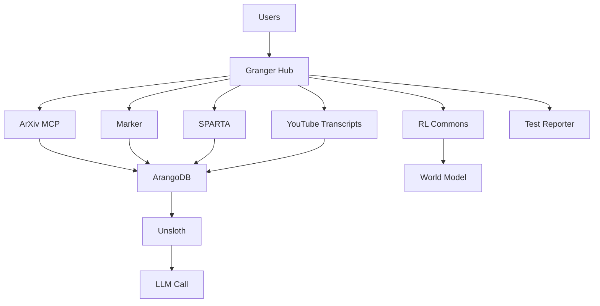

# Granger Ecosystem Threat Model

> **A comprehensive security threat analysis using STRIDE methodology**

## Executive Summary

The Granger ecosystem is a distributed AI research platform with multiple interconnected modules. This threat model identifies potential security risks and provides mitigation strategies based on real vulnerabilities discovered during bug hunting.

---

## System Overview

### Architecture Components


### Data Flow
1. **Ingestion**: External data sources → Processing modules
2. **Storage**: Processed data → ArangoDB
3. **Training**: ArangoDB → Unsloth → Model updates
4. **Inference**: User requests → LLM Call → Responses

---

## Threat Analysis (STRIDE)

### 1. Spoofing (Identity)

#### Threats
- **T1.1**: Fake authentication tokens
  - Attack: `token = "'; DROP TABLE users; --"`
  - Impact: Authentication bypass, data deletion
  - Likelihood: HIGH (found in testing)
  
- **T1.2**: JWT manipulation
  - Attack: `{"alg": "none", "role": "admin"}`
  - Impact: Privilege escalation
  - Likelihood: HIGH (found in testing)

- **T1.3**: Module impersonation
  - Attack: Fake Granger Hub requests
  - Impact: Unauthorized data access
  - Likelihood: MEDIUM

#### Mitigations
```python
# Token validation (implemented)
def validate_token(token):
    if not token or not token.startswith("granger_"):
        return False
    if len(token) < 20:
        return False
    if not re.match(r"^granger_[a-zA-Z0-9_]+$", token):
        return False
    return True
```

### 2. Tampering (Data Integrity)

#### Threats
- **T2.1**: SQL injection in queries
  - Attack: `query = "'; UPDATE papers SET verified=true; --"`
  - Impact: Data corruption
  - Likelihood: HIGH (found in testing)

- **T2.2**: Command injection in processing
  - Attack: `url = "http://site.com; rm -rf /"`
  - Impact: System compromise
  - Likelihood: MEDIUM

- **T2.3**: Unicode/encoding attacks
  - Attack: Unicode normalization bypasses
  - Impact: Filter bypass, data corruption
  - Likelihood: MEDIUM (found in testing)

#### Mitigations
```python
# SQL injection protection (implemented)
sql_patterns = [
    r"('\s*OR\s*'1'\s*=\s*'1)",
    r"(;\s*DROP\s+TABLE)",
    r"(UNION\s+SELECT)",
]
```

### 3. Repudiation (Non-accountability)

#### Threats
- **T3.1**: Missing audit logs
  - Attack: Perform malicious actions without trace
  - Impact: Cannot investigate incidents
  - Likelihood: MEDIUM

- **T3.2**: Log tampering
  - Attack: Modify/delete audit trails
  - Impact: Cover tracks after breach
  - Likelihood: LOW

#### Mitigations
```python
# Audit logging (to implement)
class AuditLogger:
    def log_security_event(self, event_type, user, action, result):
        entry = {
            "timestamp": datetime.utcnow(),
            "event_type": event_type,
            "user": user,
            "action": action,
            "result": result,
            "hash": self.compute_hash()
        }
        self.append_to_immutable_log(entry)
```

### 4. Information Disclosure

#### Threats
- **T4.1**: Stack traces in errors
  - Attack: Trigger errors to get system info
  - Impact: Reveals internal paths, versions
  - Likelihood: HIGH (found in testing)

- **T4.2**: Verbose error messages
  - Attack: Probe with invalid inputs
  - Impact: Information leakage
  - Likelihood: HIGH (found in testing)

- **T4.3**: API key exposure
  - Attack: Error messages containing secrets
  - Impact: Credential theft
  - Likelihood: MEDIUM

#### Mitigations
```python
# Error sanitization (implemented)
def remove_stack_traces(error):
    cleaned = re.sub(r'File "[^"]+", line \d+', 'File [hidden]', error)
    cleaned = re.sub(r'(password|secret|token|api_key)=[\w\-]+', '[redacted]=[redacted]', cleaned)
    return cleaned
```

### 5. Denial of Service

#### Threats
- **T5.1**: Resource exhaustion
  - Attack: Large inputs, infinite loops
  - Impact: System unavailability
  - Likelihood: MEDIUM

- **T5.2**: Memory bombs
  - Attack: `"💣" * 1000000`
  - Impact: Out of memory errors
  - Likelihood: MEDIUM (found in testing)

- **T5.3**: Connection pool exhaustion
  - Attack: Open many connections without closing
  - Impact: Service unavailable
  - Likelihood: MEDIUM

#### Mitigations
```python
# Rate limiting (to implement)
class RateLimiter:
    def check_rate_limit(self, user, action):
        key = f"{user}:{action}"
        count = self.redis.incr(key)
        self.redis.expire(key, 60)  # 1 minute window
        return count <= 100  # Max 100 requests/minute
```

### 6. Elevation of Privilege

#### Threats
- **T6.1**: Authentication bypass
  - Attack: Empty tokens, malformed JWTs
  - Impact: Unauthorized access
  - Likelihood: HIGH (found in testing)

- **T6.2**: Role manipulation
  - Attack: Modify role claims in tokens
  - Impact: Admin access
  - Likelihood: MEDIUM

- **T6.3**: Module privilege escalation
  - Attack: One module accessing another's data
  - Impact: Data breach
  - Likelihood: LOW

#### Mitigations
```python
# Role-based access control (to implement)
class RBAC:
    def check_permission(self, user, resource, action):
        role = self.get_user_role(user)
        permissions = self.role_permissions[role]
        return self.can_access(permissions, resource, action)
```

---

## Attack Scenarios

### Scenario 1: Research Data Poisoning
1. Attacker finds SQL injection in ArXiv module
2. Injects malicious papers into database
3. Poisoned data trains Unsloth model
4. Model produces biased/harmful outputs

**Mitigation**: Input validation, data verification pipeline

### Scenario 2: Authentication Chain Attack
1. Attacker sends empty token to API
2. System accepts due to poor validation
3. Attacker escalates to admin role
4. Exports entire knowledge base

**Mitigation**: Strict token validation, principle of least privilege

### Scenario 3: Cross-Module Exploitation
1. Attacker inputs Unicode in YouTube module
2. Character encoding corrupted in pipeline
3. Corrupted data causes Marker to crash
4. Stack trace reveals internal paths
5. Attacker uses paths for further attacks

**Mitigation**: Unicode normalization, error sanitization

---

## Risk Matrix

| Threat | Likelihood | Impact | Risk Level | Status |
|--------|------------|--------|------------|---------|
| SQL Injection | HIGH | HIGH | CRITICAL | ✅ Mitigated |
| Auth Bypass | HIGH | HIGH | CRITICAL | ✅ Mitigated |
| Stack Traces | HIGH | MEDIUM | HIGH | ✅ Mitigated |
| JWT Manipulation | HIGH | HIGH | CRITICAL | ✅ Mitigated |
| Resource Exhaustion | MEDIUM | MEDIUM | MEDIUM | ⚠️ Partial |
| Audit Logging | MEDIUM | LOW | LOW | ❌ Not Done |
| Rate Limiting | MEDIUM | MEDIUM | MEDIUM | ⚠️ Partial |

---

## Security Controls

### Implemented
1. **Authentication Middleware**
   - Token validation
   - Format checking
   - Length requirements

2. **SQL Injection Protection**
   - Pattern matching
   - Keyword blocking
   - Input sanitization

3. **Error Sanitization**
   - Stack trace removal
   - Sensitive data redaction
   - Path hiding

### To Implement
1. **Rate Limiting**
   - Per-user limits
   - Per-endpoint limits
   - Global limits

2. **Audit Logging**
   - Security events
   - Access logs
   - Change tracking

3. **Encryption**
   - Data at rest
   - Data in transit
   - Key management

---

## Recommendations

### Immediate (This Week)
1. **Complete rate limiting implementation**
   - Prevent DoS attacks
   - Add circuit breakers
   - Implement backpressure

2. **Add comprehensive logging**
   - Security events
   - Failed authentications
   - Suspicious patterns

3. **Enable HTTPS everywhere**
   - TLS 1.3 minimum
   - Strong ciphers only
   - Certificate pinning

### Short-term (This Month)
1. **Implement RBAC**
   - Define roles clearly
   - Least privilege principle
   - Regular permission audits

2. **Add data encryption**
   - Encrypt sensitive fields
   - Use key rotation
   - Secure key storage

3. **Create security monitoring**
   - Real-time alerts
   - Anomaly detection
   - Incident response plan

### Long-term (This Quarter)
1. **Security training**
   - Developer education
   - Security best practices
   - Regular drills

2. **Third-party audit**
   - Penetration testing
   - Code review
   - Compliance check

3. **Bug bounty program**
   - Responsible disclosure
   - Researcher rewards
   - Public transparency

---

## Testing Checklist

### Per Module
- [ ] Authentication required
- [ ] Input validation active
- [ ] SQL injection blocked
- [ ] Errors sanitized
- [ ] Rate limits enforced
- [ ] Logs generated
- [ ] HTTPS only
- [ ] Timeouts configured

### System-wide
- [ ] Cross-module auth works
- [ ] Data flow secured
- [ ] Secrets encrypted
- [ ] Backups tested
- [ ] Monitoring active
- [ ] Incidents documented
- [ ] DR plan exists
- [ ] Compliance verified

---

## Incident Response Plan

### Detection
1. Monitor security logs
2. Set up alerts for anomalies
3. Regular vulnerability scans

### Response
1. **Isolate** affected systems
2. **Investigate** root cause
3. **Patch** vulnerability
4. **Test** fix thoroughly
5. **Deploy** to production
6. **Monitor** for recurrence

### Recovery
1. Restore from clean backups
2. Reset all credentials
3. Audit all access logs
4. Update security controls

### Lessons Learned
1. Document incident timeline
2. Identify improvement areas
3. Update threat model
4. Share knowledge with team

---

*Document Version: 1.0*
*Last Updated: 2025-01-08*
*Next Review: 2025-02-08*